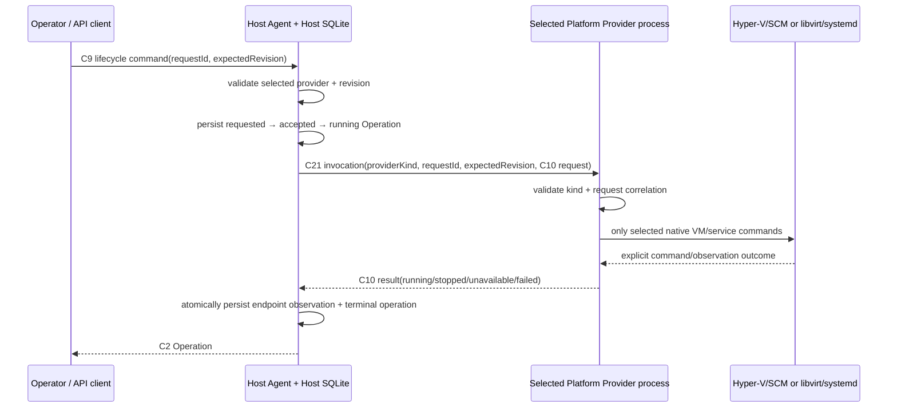

# Cross-platform provider and delivery hardening

> 상태: **구현 및 portable acceptance 완료 / OS clean-host release proof는 명시적으로 pending**
>
> 범위: `runtime-platform/`의 Windows Hyper-V/SCM, Linux KVM/libvirt/systemd provider bridge, C32/C33 deployment configuration, C21–C24 계약, source-inventory SBOM, OS별 release-proof gate. 이 문서는 어떤 사실이 자동 검증되었고 어떤 사실이 실제 OS runner 없이는 아직 주장될 수 없는지를 고정한다.

## 1. 결정 요약

Cross-platform delivery는 Host core에 OS 조건문이나 fallback을 넣지 않는다. Host Agent는 deployment configuration에 적힌 `providerKind` 하나를 `GuestRuntimeControlEndpoint`에 저장하고, 그 Platform Provider process 하나만 호출한다.

| 사실 | Owner | durable form / evidence | 뜻하지 않는 것 |
| --- | --- | --- | --- |
| provider 선택, request ID/revision idempotency, Host operation | Host Agent | Host SQLite `Operation`, `GuestRuntimeControlEndpoint` | native VM/service가 실제로 실행됐다는 것 |
| VM 및 Host service의 native effect/live observation | selected platform provider | C10 result, C22 installation evidence | Guest Runtime readiness, 다른 OS provider 사용 허용 |
| intended installer artifact와 required Host service registration의 요구 stage | Release process | C23 `ReleaseDeliveryPlan` | package가 생성·서명·설치됐다는 것 |
| clean install/reboot/update/rollback/uninstall proof | matching OS clean-host runner | C24 `ReleaseDeliveryProofSet` + `ObservedInstallerArtifact` + evidence URI/SHA-256 | portable unit/compile 성공 |
| source dependency inventory | SBOM generator | SPDX 2.3 source inventory | release artifact SBOM 또는 third-party notice completion |

이 분리는 특히 중요하다. Host SQLite의 `running` operation은 Platform Provider process effect 전의 durable admission 사실이다. VM이 running인지와 Host service가 실행 중인지의 authoritative 사실은 selected process가 직접 관측해서 C10/C22로 반환한다. release plan JSON은 artifact를 만들지 않으며 pending proof는 install success가 아니다.

## 2. Provider contract and flow



`requestId` plus `expectedGuestRuntimeControlEndpointRevision`의 durable idempotency owner는 Host Agent다. Platform Provider process가 별도 JSON/SQLite lifecycle ledger를 만들지 않는 이유는 provider가 Host operation state owner가 아니기 때문이다. process는 C21의 two correlation values가 C10 request와 일치하는지 검증하고, 현재 native VM observation이 이미 desired state이면 불필요한 VM action을 실행하지 않는다. Host는 동일 request ID를 먼저 durable operation으로 찾으므로 process effect를 다시 실행하지 않는다.

다음은 금지된다.

- selected Linux provider가 unavailable/failed이면 macOS 또는 Windows provider를 실행하는 것;
- Hyper-V/libvirt command text, process exit, 기존 DB row만으로 Guest Runtime readiness를 만드는 것;
- service registration plan이 있다는 이유로 package installation success를 표시하는 것;
- `pending` clean-host proof를 `verified`나 install success로 format하는 것.

## 3. Native provider boundary

| provider kind | executable | Host OS | native dependencies | C22 service manager |
| --- | --- | --- | --- | --- |
| `macos-virtualization` | `macos-virtual-machine-supervisor` | macOS | Apple Virtualization | `launchd` |
| `windows-hyperv-scm` | `windows-hyperv-scm-bridge.exe` | Windows | Hyper-V PowerShell module, Windows SCM | `windows-scm` |
| `linux-kvm-libvirt-systemd` | `linux-kvm-libvirt-systemd-bridge` | Linux | `virsh`, `systemctl` | `systemd` |

Windows/Linux bridge source is in `runtime-platform/providers/os-provider-bridge/`. It compiles independently for both target OSes. Its side-effect port is one command executor; unit tests supply exact outputs/errors rather than parsing a host log.

- Linux reads `virsh domstate` and `systemctl is-active`, then uses only `virsh start/shutdown/reboot` and `systemctl start/stop/restart` for the selected configuration.
- Windows reads `Get-VM` and `Get-Service`, then uses only `Start/Stop/Restart-VM` and `Start/Stop/Restart-Service`. VM and service names are PowerShell single-quoted/escaped; there is no shell interpolation fallback.
- missing configuration/native executable, wrong host OS, command error, and unrecognised native state produce C10 `unavailable` or `failed` with an issue. They do not trigger a provider substitution.

C22 `ProviderInstallationEvidence` keeps `installation`, `virtualMachine`, `service`, `guest-vm-lifecycle`, and `host-service-lifecycle` separate. A bridge’s `--mode evidence` response is provider-owned observation input for support/release evidence, not a Host-created health summary.

Host Agent는 C33 `HostAgentDeploymentConfiguration` 하나를 service launch input으로 사용한다. C33은 **Host service instance**를 구성하고, C21은 **한 번의 lifecycle effect**에 대한 request ID/revision correlation이다. macOS C33은 C32 `MacOSVirtualMachineConfiguration` path와 `macOSVirtualMachineSupervisorExecutablePath`를 포함한다. C32는 **하나의 Guest VM**을 구성하며 kernel/initrd, disk image, CPU/memory, NAT attachment, unicast MAC이 모두 명시되어야 한다. Windows/Linux C33은 `nativeProviderBridgeExecutablePath`, native VM과 Host service name을 포함한다. Host Agent와 selected process는 설치 directory, VM name, 이전 process state에서 이 값을 만들어 내지 않는다.

Host service registration과 Guest lifecycle은 같은 event가 아니다. macOS PKG는 C23이
선언한 `host-agent`와 `host-edge-proxy` launchd registration을 각각 bootstrap하지만,
그 어느 service도 Guest VM을 자동으로 start하지 않는다. Host Agent만 C33으로 시작하며
VM lifecycle은 반드시 C9 command의 request ID와 expected resource revision을 통해
Host Agent가 admission해야 한다. 이 구분 때문에 installer/postinstall은 Guest start
HTTP request를 보내지 않으며, C24 clean-host proof는 두 Host service registration 후
별도의 explicit C9 start와 provider observation을 증명해야 한다.

## 4. Delivery and service-lifecycle contract

`product/platform-providers/` declares supported provider selections. `product/delivery/release-delivery-plans.v1.json` declares one C23 plan per OS and identifies the `intendedInstallerArtifact` plus both `requiredHostServiceRegistrations` (`host-agent`, `host-edge-proxy`). The macOS plan also owns `macOSInstallerPackageIdentifier`, so package receipt identity is not inferred from a filename, install path, or service label. It uses no inferred data path, VM name, service name, endpoint, or credential.

Every plan requires all eight C24 stages. A `verified` C24 record names the
`ObservedInstallerArtifact` (kind, fileName, productVersion, SHA-256,
observedAt) that its clean-host runner actually inspected or installed. The
verifier matches kind/fileName/productVersion to C23; a runner may not turn an
unrelated installer, stale service registration, or evidence URI into current
release proof.

For macOS `clean-install`, C24 additionally requires an
`ObservedMacOSInstallerReceipt` whose package identifier and product version
match C23. This makes the post-installer Host receipt an explicit fact rather
than assuming it from `installer` exit code or a launchd plist. The
`MacOSCleanHostReleaseEvidenceRunner` keeps this run state in its own SQLite
journal and emits reviewable fragments; it does not alter Host Agent state or
silently edit the release proof document. See [macOS Clean-Host Release
Evidence](macos-clean-host-release-evidence-boundary.md).

Every plan requires all eight C24 stages:

1. `artifact-integrity`
2. `sbom-and-notices`
3. `clean-install`
4. `service-registration`
5. `reboot`
6. `update`
7. `rollback`
8. `uninstall-reinstall`

`uninstall-reinstall` must capture the operator’s explicit retention/purge choice. The system must not silently remove a Host data path merely because service registration was removed.

For a verified `service-registration` stage, C24 must additionally list one
`ObservedHostServiceRegistration` for each C23 role, including manager, service
name, `registrationState=registered`, and `observedAt`. The release verifier
rejects evidence that omits a required service or claims a different service
name/manager. Registration evidence is still distinct from Guest VM start and
Guest Runtime readiness.

The checked-in SPDX document is generated from `sbom-policy.v1.json` and is named **source inventory** deliberately. It is reproducible dependency/license input and has a document comment stating that it is not artifact evidence. A per-artifact SPDX plus aggregated notices and a hash/URI are required before the C24 `sbom-and-notices` proof can become `verified`.

## 5. Verification boundary

The development suite proves:

```sh
make -C runtime-platform portable-provider-test
make -C runtime-platform source-inventory-check
make -C runtime-platform delivery-proof-check
make -C runtime-platform cross-platform-delivery-acceptance
```

- provider unit tests and Linux/Windows cross-compilation;
- C21 C10 correlation, selected-provider failure, and Host SQLite request/revision replay behavior via real Host public HTTP;
- contract examples and C22/C23/C24 schema validation;
- deterministic source inventory SBOM generation;
- every planned OS/stage has exactly one explicit C24 status record.
- C35 `GuestArtifactCompilationCommand` requires one selected builder executable and every Guest source identity. `GuestArtifactCompiler` atomically emits C34 plus C35 receipt only after exact input/builder identity and declared output validation; it does not find a prior VM cache, download a base image, or prove boot.
- the macOS package composer accepts only C35-receipt-correlated C34 prebuilt artifacts plus C32/C33 and materializes those exact paths into a launchd PKG payload; C34 byte size/SHA-256 must match every supplied Guest artifact and the C35 receipt must name that exact C34. It does not create a package from missing Guest assets or configuration defaults.

The workspace is macOS. It has **not** installed an MSI, registered SCM, booted Hyper-V, installed a DEB, used libvirt/systemd, rebooted a clean Windows/Linux machine, or proven update/rollback/uninstall. `release-delivery-proofs.v1.json` therefore records all Windows/Linux stages as `pending`, not success.

`make -C runtime-platform release-ready` intentionally fails while any C24 stage is pending. It is a release assertion to execute only after a matching clean-host runner has generated per-artifact evidence. Its failure in this workspace is expected evidence of an incomplete release proof, not a compile failure to hide.

## 6. Acceptance scenarios

`acceptance/features/cross-platform-delivery.feature` and `test_cross_platform_delivery.py` prove two portable scenarios with the real Host Agent and a deterministic bridge fixture:

1. a `windows-hyperv-scm` selection sends one C21 invocation with the exact request ID/revision, deduplicates same-request replay, and rejects action reuse/stale revision before another bridge call;
2. a `linux-kvm-libvirt-systemd` provider `unavailable` result produces a failed Host operation plus unavailable provider/transport observations without trying macOS or Windows;
3. an unknown provider kind fails during Host composition instead of choosing a default.

The fixture is intentionally not called “Hyper-V” or “libvirt” proof. Actual native behavior is covered by unit-level command contracts and remains release-runner work until C24 contains real evidence.
