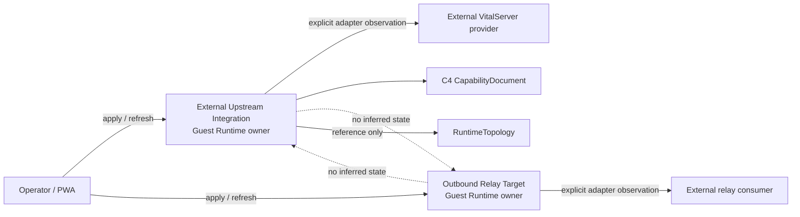
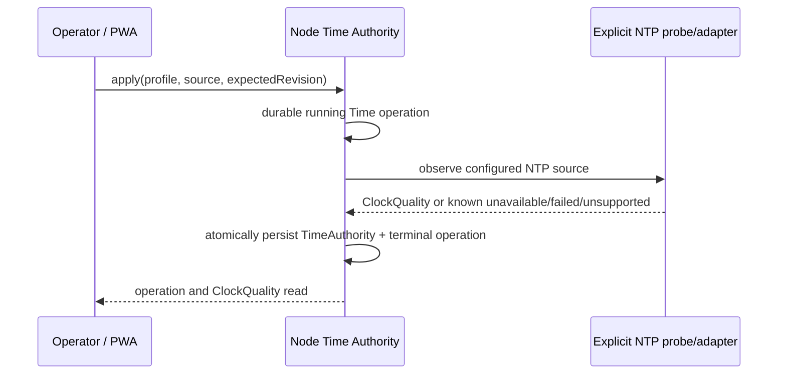

# External upstream, time, and observability profile

> 상태: **구현 및 public-contract acceptance 완료**
>
> 범위: external VitalServer upstream, independent outbound relay, Host/Guest time authority, Recorder self-observation Catalog, vendor-neutral OpenTelemetry pipeline. 이 문서는 이 사실들을 topology, packet delivery, Lab lifecycle, Archive Export 성공과 섞지 않는 경계를 고정한다.

## 1. 결정 요약

이 경계는 다음 다섯 owner를 추가하거나 명확하게 한다.

| 사실 | Owner | durable resource | 이것이 뜻하지 않는 것 |
| --- | --- | --- | --- |
| 외부 VitalServer 설정·관측·capability | Guest Runtime External Upstream module | `ExternalUpstreamIntegration`, C4 `CapabilityDocument` | bundled stack lifecycle, packet delivery, archive indexing |
| 외부 relay target 설정·관측 | Guest Runtime Relay module | `OutboundRelayTarget` | upstream connection/capability, consumer business 처리 성공 |
| Host/Guest NTP profile과 품질 | 각 node의 Time Authority | `TimeAuthority`, `ClockQuality` | Recorder clock, delivery/admission 성공 |
| Recorder가 말한 runtime/time 사실의 query projection | Guest Runtime Observation Catalog | `CatalogObservation` | Gateway socket 상태, device의 실제 현재 상태 |
| logs/metrics/traces export pipeline | 각 node의 Telemetry Pipeline | `TelemetryPipeline`, `TelemetryEmissionReceipt` | product operation, upstream delivery, archive, NTP 성공 |

특히 `external-upstream`은 `RuntimeTopology` 안의 문자열이 아니다. Guest Runtime이 별도로 소유하는 `ExternalUpstreamIntegration`을 먼저 구성·관측하고, external topology는 그 resource를 reference한다. topology는 선택한 integration의 **그 시점 availability/capability observation**만 status에 기록한다. topology는 별도의 probe owner가 아니므로 available integration의 `reachable` connection을 topology의 `connected`로 바꾸지 않고 `not-checked`로 남긴다. 실제 connection fact는 integration resource에서 읽는다. integration이 갱신되어도 topology status, delivery receipt, Lab state를 몰래 바꾸지 않는다.

## 2. External Upstream과 Relay의 독립성



### 2-1. ExternalUpstreamIntegration

`ExternalUpstreamIntegration`은 다음 두 층을 분리한다.

- `spec`: provider identity, endpoint reference, credential reference. URL, secret, Redis key, provider-private state는 넣지 않는다.
- `status`: adapter가 반환한 `available`, `unavailable`, `failed`, `unsupported` observation, connection fact, C4 capability reference/revision, typed issue.

`apply external integration` command는 requested spec을 persist하는 operation이다. provider가 `unavailable`이라고 명시해도 configuration operation 자체는 성공할 수 있으며 resource status가 `unavailable`으로 남는다. 반대로 adapter call의 outcome 자체를 알 수 없으면 operation은 durable `running`으로 남고 resource status나 capability를 추정하지 않는다.

External provider capability는 최소한 다음을 explicit하게 보여준다.

- delivery/upload/observation query 중 실제로 provider가 제공한 것;
- `upstream.lifecycle.start`, `upstream.lifecycle.stop`, `upstream.update`, `upstream.backup`이 **unsupported**라는 것.

이 capability는 bundled capability를 복사하거나 HTTP/TCP reachability에서 추론하지 않는다.

### 2-2. OutboundRelayTarget

Relay target은 `RuntimeTopology`의 profile이 아니다. bundled 또는 external upstream이 존재하지 않아도 independent resource로 구성·관측할 수 있다. Relay adapter가 반환하는 것은 target reachability/protocol acknowledgement뿐이며 consumer의 decode, pending queue, business handling, clinical 저장 성공은 추정하지 않는다.

`OutboundRelayTarget`은 own `resourceRevision`, operation, status를 가진다. external upstream status와 relay status 사이에는 field 공유, fallback, automatic reconfiguration이 없다.

## 3. Time Authority

각 Host와 Guest는 자기 node의 `TimeAuthority`를 소유한다. Host가 Guest clock quality를 만들거나 Guest가 Host NTP daemon 상태를 읽지 않는다.



`ClockQuality` is one of `configured`, `synchronizing`, `synchronized`, `unsynchronized`, `stale`, `unsupported`, `failed`. A timestamp alone is never proof of synchronization. `synchronized` requires source, stratum, offset, uncertainty, and last-sync evidence. `unsynchronized`, `stale`, `unsupported`, and `failed` require a typed issue.

The enterprise NTP profile is a declared source selection (`enterprise-ntp` + source reference), not a hidden system-default fallback. An unreadable probe or unknown effect outcome remains a typed dependency/admission result; it never becomes `synchronized` or `not-reported`.

## 4. Recorder self-observation Catalog

Vital Recorder owns its self-report. The report uses C19 `RecorderObservationEnvelope` with `recorderId`, `bootId`, `sequence`, device-owned `occurredAt`, time observation, and runtime observation. Gateway may supply its own receipt/received fact in a separate envelope, but may not overwrite `occurredAt` or manufacture device health from packet arrival.

The Guest Runtime Observation Catalog owns an immutable query projection:

```text
RecorderObservationEnvelope
  -> Catalog ingest operation
  -> CatalogObservation { source envelope, receivedAt, persistedAt }
  -> recorder-scoped history/read API
```

The idempotency identity is explicitly `(recorderId, bootId, sequence)`. A replay with the same source identity and same envelope returns the recorded observation; a different envelope for that identity is a conflict. A Catalog read failure is `failed`/`unavailable`, never an empty recorder list or an inferred offline state.

## 5. Vendor-neutral OpenTelemetry pipeline

The platform uses OpenTelemetry signal vocabulary and OTLP transport profiles only; it does not require a commercial backend. The product profile supplies an open-source OTel Collector configuration. Each service emits correlation-safe logs, metrics, and traces; `TelemetryCorrelation` is diagnostic evidence, not product state.

Before a signal leaves a process, the Telemetry Pipeline applies these non-negotiable rules:

1. only an allowlisted attribute set is emitted;
2. raw waveform, packet bytes/digest, patient identifiers, credentials, authorization material, endpoint secrets, and arbitrary unbounded labels are dropped;
3. attribute count/value length and per-key cardinality are bounded;
4. accepted, sampled/dropped, unavailable, failed, and outcome-unknown export facts remain separate receipt/pipeline states;
5. collector/backend health never changes a product command, delivery receipt, archive receipt, Lab state, or clock quality.

The first profile supports `logs`, `metrics`, and `traces` together. A signal can be dropped by policy without treating the product event that produced it as failed; a pipeline can be unavailable without treating the original product event as successful or failed.

## 6. Public contract/API surface

| Contract | Owner | Public resource/command | Purpose |
| --- | --- | --- | --- |
| C16 `ExternalUpstreamIntegration`, command | Guest Runtime External Upstream | `/v1/runtime/external-upstreams` | explicit external provider configuration and observation |
| C4 `CapabilityDocument` | Guest Runtime External Upstream | `/v1/runtime/capabilities` | provider feature matrix, including explicit unsupported lifecycle/update/backup |
| C17 `OutboundRelayTarget`, command | Guest Runtime Relay | `/v1/runtime/relay-targets` | independent relay configuration and observation |
| C18 `TimeAuthority`, command, `ClockQuality` | Host Time Authority / Guest Time Authority | `/v1/platform/time/*`, `/v1/time/*` | NTP profile and node-local quality |
| C19 Recorder self-observation envelope, `CatalogObservation`, ingest command | Vital Recorder source / Guest Runtime Observation Catalog | `/v1/runtime/catalog/recorder-observations` | immutable Recorder self-observation projection |
| C20 `TelemetryPipeline`, signal command, receipt/correlation | Host/Guest Telemetry Pipeline | `/v1/platform/telemetry/*`, `/v1/runtime/telemetry/*` | redacted/bounded logs-metrics-traces export evidence |

Host Agent forwards only the documented Guest Runtime routes unchanged. It owns its own Time/Telemetry resources and never combines them with Guest results.

## 7. Acceptance evidence

This boundary is complete only when public-contract acceptance proves all of the following.

1. An external integration can be configured as available, unavailable, failed, or unsupported; its capability matrix explicitly marks lifecycle/update/backup unsupported.
2. An external topology references the integration and returns its own explicit capability/connection state; it never falls back to bundled.
3. A relay can be available while external upstream is unavailable (and vice versa) without either resource being rewritten.
4. Host and Guest time quality are node-local; synchronized requires full quality evidence, and an unavailable/failed probe cannot become synchronized.
5. A Recorder self-observation is stored as a Catalog source projection with its original `occurredAt`; duplicate/replayed identity handling is explicit.
6. Logs, metrics, traces are all accepted through the telemetry profile, sensitive/unbounded attributes are redacted/dropped with evidence, and collector failure/drop state does not change a product operation or delivery state.

The required proof command is:

```sh
make -C runtime-platform check
```

This boundary deliberately does not claim Windows/Linux OS provider, installer/reboot/update/rollback/uninstall proof. Those are cross-platform delivery gates.

## 8. 구현 위치와 의도적인 proof 한계

| owner | 구현 위치 | durable state | public proof |
| --- | --- | --- | --- |
| External Upstream / Relay | `runtime-platform/services/guest-runtime/internal/guestruntimeapplication/{external_upstream,outbound_relay}.go` | Guest SQLite의 별도 integration/relay table | external C4 capability와 relay를 별도 process profile에서 조회 |
| Guest Time / Catalog / Telemetry | `runtime-platform/services/guest-runtime/internal/guestruntimeapplication/{time_authority,observation_catalog,telemetry}.go` | Guest SQLite의 time/catalog/telemetry table | Guest public route로 clock evidence, immutable `occurredAt`, receipt를 조회 |
| Host Time / Telemetry | `runtime-platform/services/host-agent/internal/hostagentapplication/{host_time_authority_application_service,host_telemetry_pipeline_application_service}.go` | Host SQLite의 `host_*` table | `/v1/platform/time/*`, `/v1/platform/telemetry/*`로 Guest와 독립된 node state를 조회 |
| Product profile | `runtime-platform/product/time/`, `runtime-platform/product/observability/` | 없음 — deployment declaration | profile은 source/collector를 명시할 뿐 owner state를 만들지 않음 |

`acceptance/harness/test_external_time_observability.py`는 real Guest Runtime
application composition을 `guest-runtime-control-http-acceptance-fixture`로, Host는
test-only composition으로 각각 별도 SQLite에서 실행한다. fixture는 public
HTTP/application boundary를 증명하지만 production Linux Guest AF_VSOCK transport를
대체하지 않는다. harness는 public HTTP와 JSON Schema만 사용하며 owner DB를 열지
않는다. `available`, `unavailable`, `failed`, `unsupported`, `outcome-unknown`은
각각 명시된 test/deployment profile adapter의 결과다. 특히 `outcome-unknown`은
resource/receipt를 만들지 않고 durable `running` operation만 남기는지를 증명한다.

현재 executable의 기본 physical-provider mode는 Time/Telemetry 모두 `unsupported`이다. 이는 local clock 또는 endpoint 환경변수에서 성공을 추정하지 않기 위한 선택이다. production deployment는 인증된 node-local NTP probe와 OTLP exporter adapter를 명시적으로 설치·선택해야 한다. `product/observability/otel-collector.yaml`은 permissive/open-source OpenTelemetry Collector profile이며, backend endpoint도 명시적으로 주입해야 한다. collector/NTP의 실제 network conformance, OS service registration, signing, installer, reboot/rollback/uninstall은 cross-platform delivery proof로 남긴다.

### v1 baseline correction before first release

아직 배포되지 않은 initial v1 baseline은 `/v1/runtime/telemetry/signals`의 `202` body를 receipt로 잘못 선언했지만, 모든 command owner와 실제 implementation은 durable `Operation`을 반환하고 receipt는 operation evidence reference로 조회한다. 이는 published contract의 호환성 변경이 아니라 initial baseline 작성 오류이므로, 첫 release 전에 source와 baseline을 함께 재생성했다. 이후 published v1에서는 이 route의 body를 바꾸지 않고 새 major/route를 사용해야 한다.
