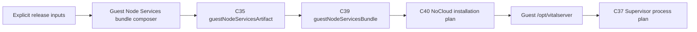

# Guest Node Services bundle boundary

> 상태: **구현됨**
>
> 범위: Guest에서 함께 실행되는 Node runtime, Recorder Gateway, Lab Recorder
> Runner와 Runner의 scenario catalog을 하나의 immutable release input으로
> 구성하고 Guest bootstrap에 설치하는 packaging boundary.

## 문제와 결정

C37은 Recorder Gateway와 Lab Recorder Runner를 모두 필수 Guest process로
선언한다. 하지만 과거 C35/C39는 Gateway archive만 설치 대상으로 선언했다.
그 상태에서는 Runner process plan이 유효해도 설치된 Guest에는 프로그램이나
scenario catalog이 없을 수 있었다.

이를 `Guest Node Services Bundle`로 명시한다. Bundle은 하나의 process나
runtime state가 아니라, C37이 필요로 하는 정적 Node delivery unit이다.

| Bundle path | consumer | owner |
| --- | --- | --- |
| `node/bin/node` | Gateway, Runner | release input owner |
| `recorder-gateway/dist/cmd/recorder-gateway.js` | Guest Product Supervisor | Recorder Gateway build |
| `lab-recorder-runner/dist/cmd/lab-recorder-runner.js` | Guest Product Supervisor | Lab Recorder Runner build |
| `lab-recorder-runner/lab-scenario-catalog.json` | Lab Recorder Runner | product scenario catalog |

The catalog intentionally lives beside the Runner in the immutable bundle. It
is a release-selected scenario definition, not Lab session state and not an
operator upload. Session selection remains in Guest Runtime SQLite.

## Contract flow



`guest_node_services_bundle_composer.py` accepts only absolute, existing,
non-symlink inputs. It verifies the four required paths, rejects source
symlinks that escape a declared tree, writes a deterministic tar-gzip archive,
and never overwrites an output path. C41 subsequently captures the composed
archive's exact size and SHA-256; C35/C40 retain that identity.

## Non-responsibilities

The bundle composer does not download or execute Node, invoke npm, compile
TypeScript, create a Lab session, infer a scenario, open a Socket.IO connection,
or observe a Guest process. Those facts remain explicit at their respective
build, Guest Runtime, Runner, and Supervisor boundaries.

## Verification

`make -C runtime-platform guest-node-services-bundle-test` proves the required
archive entries, exact scenario bytes, output identity, and rejection of
escaping symlinks or output overwrite. Creating a real artifact additionally
requires the caller to supply a selected Linux ARM64 Node distribution root and
a new output path:

```sh
make -C runtime-platform guest-node-services-bundle \
  GUEST_NODE_DISTRIBUTION_ROOT=/absolute/node-v20.19.3-linux-arm64 \
  GUEST_NODE_SERVICES_BUNDLE_OUTPUT=/absolute/output/guest-node-services.tar.gz
```

This is build evidence only. Guest boot, Supervisor start, Runner connectivity,
Gateway capture, `.vital` formation, upload, and indexing require separate
runtime/acceptance evidence. In particular, a C35/C40 build proves the
immutable archive and its Guest installation intent, not that an archive was
expanded or a Node process started inside a Guest.
