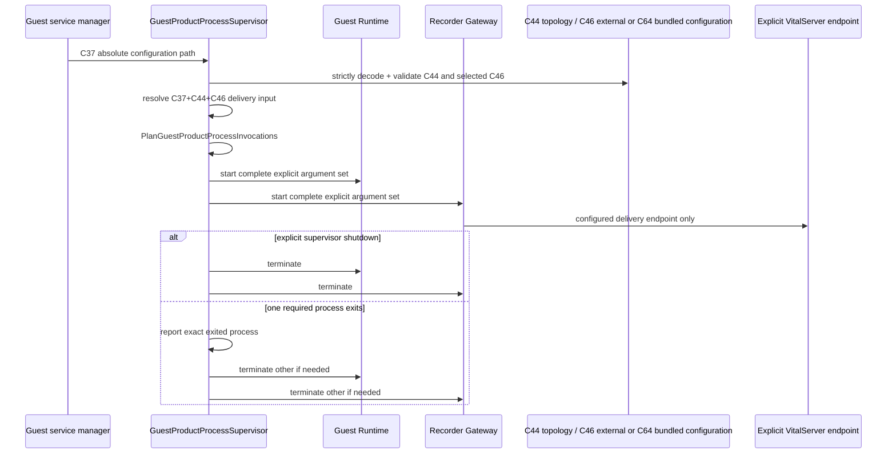

# Guest Product Process Supervisor 경계

> 상태: C37/C44/C46 external 및 C37/C44/C64 bundled desired configuration·pure delivery resolution·pure launch plan·required-process termination test 구현 완료 / Guest boot·service-manager runtime proof는 pending

Guest 안의 `GuestProductProcessSupervisor`는 **Guest Runtime과 Recorder Gateway라는
두 required product process의 process lifetime만** 소유한다. Host Agent는 VM lifecycle과
Host 상태를 소유하며 Guest 내부 child process를 직접 추측하거나 시작하지 않는다.

## 이름으로 읽는 구조

```text
GuestProductProcessDeploymentConfiguration (C37, process desired configuration)
  + GuestProductVitalServerTopologyDeployment (C44, placement desired configuration)
  + ExternalVitalServerDeliveryConfiguration (C46, external endpoint desired configuration when selected)
  + Guest Bundled Upstream Image-set Manager configuration (C64, bundled image-set lifecycle when selected)
  └─ GuestProductProcessSupervisor (Guest process-lifetime owner)
      ├─ GuestRuntimeProcessDeployment
      │   └─ Guest Runtime (Guest control and its SQLite-owned state)
      └─ RecorderGatewayProcessDeployment
          └─ Recorder Gateway (Recorder session, durable ingress state, delivery replay, cold-path capture, C5/C13 receipts)
```

`GuestProductProcessDeploymentConfiguration`은 generic `service-config`가 아니다.
`Guest`라는 location boundary, `ProductProcess`라는 managed concept,
`Deployment`라는 desired-input lifecycle, `Configuration`이라는 state가 아닌 문서
종류를 한 이름에서 모두 보인다. 마찬가지로
`PlanGuestProductProcessInvocations`은 pure plan이고,
`OperatingSystemGuestProductProcessLauncher`는 OS process effect adapter다.

| package | 역할 | 대표 이름 |
| --- | --- | --- |
| `guestproductprocesssupervisordomain` | C37/C44/C46 semantic validation, delivery resolution, required child invocation의 pure plan | `ResolveRecorderGatewayVitalServerDelivery`, `PlanGuestProductProcessInvocations` |
| `guestproductprocesssupervisorapplication` | resolved invocation input을 받아 start, observed child exit, sibling termination, explicit shutdown 순서 | `RunGuestProductProcessDeployment`, `GuestProductProcessLifecycleHandle` |
| `adapters/guestproductdeploymentconfigurationfile` | C37/C44/C46 owner document strict file decode | `LoadGuestProductProcessDeploymentConfiguration`, `LoadGuestProductVitalServerTopologyDeployment` |
| `guestprocessoslauncher` | planned child의 OS process start/wait/terminate effect | `OperatingSystemGuestProductProcessLauncher` |

`GuestProductProcessLifecycleHandle.WaitForGuestProductProcessExit`은 child exit이라는
관측 사실을 읽는다. `GuestProductProviderCapabilityReference`는 configured provider
selection이며 provider reachability 또는 delivery success observation이 아니다.

## C37이 명시하는 사실

| 원하는 사실 | owner | C37 field | runtime effect와 구분 |
| --- | --- | --- | --- |
| 두 process가 하나의 Guest product deployment를 이룸 | Guest Product process supervisor | `requiredProcessExitPolicy=terminate-guest-product` | child exit 관측은 configuration이 아님 |
| Guest control process executable/listener/SQLite path | Guest Runtime deployment | `guestRuntime` | SQLite open·HTTP listen 성공은 Guest Runtime state/evidence |
| Recorder ingress process Node program/listener/durable ingress state | Recorder Gateway deployment | `recorderGateway` | socket session, delivery replay, cold-path capture, C5/C13 receipt는 Gateway-owned state |
| VitalServer delivery placement | Guest Product release author | C44 `GuestProductVitalServerTopologyDeployment` | upstream reachable/delivery accepted는 Upstream/Gateway observation |
| External VitalServer delivery endpoint | external delivery deployment administrator | C46 `ExternalVitalServerDeliveryConfiguration` | topology auto-selection, connection success, delivery success |
| delivery replay/cold-path capture bounds | Recorder Gateway deployment | `deliveryReplayAdmissionPolicy`, `coldPathCapturePolicy`, `replayPolicy` | empty durable state or retry result가 아님 |
| time/telemetry adapter selection | Guest Runtime deployment | `timeAuthority`, `telemetryPipeline` | NTP synchronization/OTLP export result가 아님 |

C44 `topologyKind`의 `bundled-vitalserver`와 `external-vitalserver`는 explicit placement
selection이다. `ResolveRecorderGatewayVitalServerDelivery`는 external일 때 C44/C46
integration, configuration ID, provider kind/id/revision을 모두 대조하고, bundled일 때
C44가 고른 C64 configuration resource와 declared loopback delivery endpoint를 사용한다.
C46 또는 C64 agreement를 읽지 못하거나 대조가 실패하면 다른 topology/endpoint로 바꾸지
않고 activation을 거절한다. C37은 C64 container를 child process로 시작하지 않는다.

## 실행 흐름



Supervisor는 child stdout/stderr를 diagnostic stream으로 전달할 수 있지만 그 log를
Guest state로 해석하지 않는다. Process start와 exit는 OS effect다; packet accepted,
upstream delivery, Lab lifecycle은 각각의 bounded context만 C5, C13, C14/C15와 own
SQLite state로 제공한다.

## 현재 검증과 남은 경계

현재 tests는 C37/C44/C46 strict decode, external integration/configuration/provider
equality rejection, explicit replay policy, exact argument plan, process start failure 시
이미 시작한 child 종료, required child exit 시 sibling 종료, 그리고 explicit shutdown을
증명한다. Recorder Gateway command는 resolved C46 acknowledgement timeout과 C37
delivery replay/cold-path capture limits·retry value를 모두 required flag로 받아,
product default를 몰래 선택하지 않는다.

현재 C35는 `guestProductProcessSupervisorArtifact`와
`guestProductProcessDeploymentConfigurationArtifact`를 paired immutable input으로
받는다. C38 `GuestProductServiceManagerDeploymentConfiguration`은 separate additive
C35 input이다. 제품 PKG composer는 세 C35 receipt identity가 supplied source의
size/SHA-256과 정확히 같은지 확인한다. 이는 selected builder가 세 source bytes를
input으로 받았다는 build provenance다. `guestRuntimeConfigurationArtifact`는
Guest Runtime이나 Supervisor가 읽는 contract가 아니므로 C35/C39에서 제거했다. C37이
Guest Runtime의 유일한 desired process configuration이며, 같은 사실을 별도 inert
JSON payload로 복제하지 않는다.

아직 증명하지 않는 것:

- selected builder가 C37/Supervisor input을 release Guest image에 실제 materialize한 것;
- Linux Guest service manager registration, Guest boot 후 supervisor/process listener;
- configured bundled/external VitalServer endpoint로 Recorder packet이 전달되는 것;
- actual NTP probe 및 OTLP collector adapter의 product implementation;
- graceful termination timeout/escalation, restart policy, child health/readiness API.

이 항목은 C37에 fallback을 더하는 대신, Guest builder output contract, Guest
service-manager contract, and C24 clean-host evidence로 각각 분리해 구현한다.
