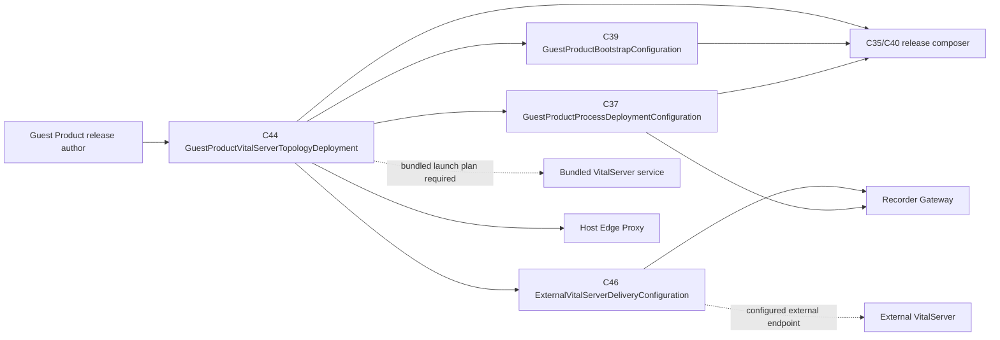

# Guest Product VitalServer topology composition boundary

> 상태: **C44 installation composition 및 C37+C44+C46 external delivery-resolution activation implemented**
>
> 범위: Guest Product가 Recorder packet을 어느 VitalServer로 전달하고, Host public
> browser route를 어떤 transport로 노출할지를 one topology declaration으로 조합하는
> boundary. 이 문서는 connection health, packet delivery receipt, VitalServer clinical
> state를 만들지 않는다.

## 문제: topology와 delivery endpoint가 한 설정에 섞이면 owner가 사라진다

초기 C37에는 topology, provider, endpoint가 함께 있었다. 그 구조에서는 `external`이라는
문자열만으로 누가 endpoint를 제공하는지, endpoint가 C16 integration과 같은 대상을
가리키는지, 혹은 package가 존재하지 않는 bundled process를 시작해야 하는지를 알 수
없었다. 특히 C39 bootstrap payload에는 Guest Runtime, Recorder Gateway, Supervisor만
있고 VitalServer executable/container/image, Redis dependency, VitalServer state store,
혹은 `:8088` listener를 시작하는 process plan은 없다.

이는 “bundled VitalServer가 unavailable”이라는 runtime observation이 아니라 **release
composition input의 불완전성**이다. C44는 placement, C46은 external endpoint configuration,
그리고 C37 Supervisor의 `ResolveRecorderGatewayVitalServerDelivery`는 세 document의 exact
reference를 대조하여 실행 인자만 만든다. 따라서 declaration 하나만으로 bundle, process
start, browser service, delivery acknowledgement를 주장하지 않는다.

## Ubiquitous language

다음 네 이름은 비슷해 보여도 owner와 fact가 다르다.

| 이름 | owner | 뜻 | 뜻하지 않는 것 |
| --- | --- | --- | --- |
| `GuestProductVitalServerTopologyDeployment` | Guest Product release author | 한 release가 선택한 bundled/external VitalServer placement와 delivery/public exposure intent | connection, packet delivery, running process |
| `VitalServerDeliveryProvider` | Recorder Gateway deployment | Gateway가 C13 receipt에 기록할 VitalServer capability identity | topology 자동 선택, fallback provider |
| `ExternalUpstreamIntegration` (C16) | Guest Runtime | external VitalServer integration의 reference·observation·capability | Gateway spool, Host public route |
| `BundledVitalServerServiceDeployment` | Guest Product release author | Guest 안에서 VitalServer service artifact와 local listener를 materialize할 desired process deployment | process가 이미 running, Redis health |
| `ExternalVitalServerDeliveryConfiguration` (C46) | external delivery deployment administrator | C44-selected external integration/provider와 explicit Socket.IO delivery endpoint를 묶은 desired configuration | C16 availability, endpoint connection, packet delivery success |

`upstream`, `endpoint`, `provider`, `bundle`만으로는 어떤 bounded context의 state인지
판단할 수 없다. C44와 C37의 field/command/module은 위 full name을 유지한다.

## 목표 topology

`GuestProductVitalServerTopologyDeployment`는 placement의 single source of truth다. C37
Supervisor는 C44와 필요한 C46을 읽어 delivery resolution을 만들고, 그 complete result만
Recorder Gateway invocation에 전달한다. C32/C36 package verification은 허용된 Guest route만
확인한다.



실선은 document/reference or invocation-input flow이고 점선은 desired target이다. 어느
arrow도 live TCP connection, process readiness, or packet-delivery success를 뜻하지 않는다.

### Bundled VitalServer topology

Bundled mode는 아래 모두를 **same C35 input identity**로 갖춰야 한다.

1. `BundledVitalServerServiceDeployment`가 executable/container runtime, declared local
   listener, state directory, and dependency policy를 명시한다.
2. C39가 그 exact artifact를 Guest destination에 install한다.
3. C37 Supervisor가 VitalServer process를 required child로 계획한다. required child exit
   policy는 Gateway/Guest Runtime shutdown semantics와 별도로 명시한다.
4. `vitalserver-browser` C37 virtio bridge와 C32 Host-local bridge, C36 browser route는
   바로 그 declared Guest-local listener와 일치한다.
5. bundled Redis or database는 VitalServer bundle dependency로 명시하고 own durable store
   and backup/update ownership을 분리한다.

하나라도 없으면 release composer는 `bundled-vitalserver composition is incomplete`로
실패해야 한다. `127.0.0.1` default, empty browser, mock Socket.IO fixture, or probe log는
bundle evidence가 될 수 없다.

### External VitalServer topology

External mode는 Helper가 VitalServer, Redis, lifecycle, update, backup을 소유하지 않는
deployment다.

1. C44 topology는 exact C16 `ExternalUpstreamIntegration` reference, selected
   `VitalServerDeliveryProvider`, and C46 configuration reference를 가진다.
2. C46 `ExternalVitalServerDeliveryConfiguration`은 위 C16 reference, provider kind/id/
   capability revision, delivery endpoint, acknowledgement timeout을 complete input으로
   제공한다. `ResolveRecorderGatewayVitalServerDelivery`가 이 모든 equality를 검증한다.
   address는 Host NAT, 이전 connection, 혹은 empty string에서 추론하지 않는다.
3. Guest Runtime owns C16 availability/capability observation; Recorder Gateway owns only
   C13 packet-delivery attempts and its private spool.
4. Host browser proxying is optional. If enabled, C36 must declare an explicit
   Host-to-external route and its trust/TLS policy. It must **not** create C32/C37
   `vitalserver-browser` virtio bridges for an external process.
5. C46 source is selected by the external delivery deployment administrator and, for an
   external C44 topology, C41→C35→C39→C40 installs its exact non-secret document at the
   declared Guest path. The package composer compares C44 integration/configuration/provider
   identity with that document; it never invents or substitutes an endpoint. Authentication
   material is outside C46 and needs a separate future secret contract. Missing/unreadable/
   invalid C46 is Gateway activation failure, not a bundled endpoint or started data plane.

## Build-time composition invariants

The C41→C35→C39→C40 path validates C44 and, for an external topology, C46; it preserves each
exact byte identity and installs both at their C39-declared Guest paths before it writes a
Guest bootstrap volume. C37 then resolves activation input only from C37, C44, and C46.

| Selected topology | Required | Forbidden |
| --- | --- | --- |
| `bundled-vitalserver` | C39 bundled service artifact, C37 bundled service invocation, one matching Guest-loopback listener, matching C32/C36 browser route when exposure is enabled | external integration reference as delivery fallback; unbundled `:8088` route |
| `external-vitalserver` | C44 C16/C46 reference, C46 matching integration+configuration ID+provider revision, Gateway activation only after configuration | bundled service invocation; C32/C37 browser bridge; inferred NAT/loopback endpoint |

Every required relationship is an equality/reference comparison over complete inputs. The
composer neither opens a socket nor probes the Guest to make the configuration pass.

## Delivery-resolution decision and evidence

The external topology decision is explicit:

```text
configuration-required
  -- C44/C46 reference and endpoint validation succeeds --> resolved
resolved
  -- Supervisor plans Recorder Gateway process arguments --> activation requested
  -- C44 or C46 is replaced before start --> configuration-required
```

`resolved` is complete desired invocation input only. It is not `available`, `reachable`,
`running`, or `delivered`. C16 reports external availability; the bundled service process
owner reports process observation; Recorder Gateway creates C13 delivery evidence. No
transition may silently substitute one topology for the other.

## Current release rule

C44 is a required C41 source, C35 immutable input, C39 file installation, and C40
bootstrap-volume source. For external topology, C46 is the corresponding required C41
source, C35 immutable input, C39 file installation, and C40 bootstrap-volume source. The
macOS PKG composer checks the supplied C46 source against its C35 receipt identity before
it creates the package; the verifier preserves C35→C34 bootstrap-volume provenance after
package expansion. A package composer cannot silently omit an external topology's declared
delivery configuration.

That is installation composition proof for C44. At runtime, C37 contains the exact C44
path and optional C46 path, the Supervisor strict-decodes both owner documents, and the
pure resolver refuses external activation unless all integration/configuration/provider
identities match. It also rejects a C46 external endpoint that points to Guest loopback.

Bundled topology remains deliberately rejected by the resolver until C44's declared
service artifact receives an explicit C37 launch plan. This is not a bundled fallback or
an availability observation. C24 clean-host proof likewise remains separate from every
topology declaration and delivery-resolution result.
