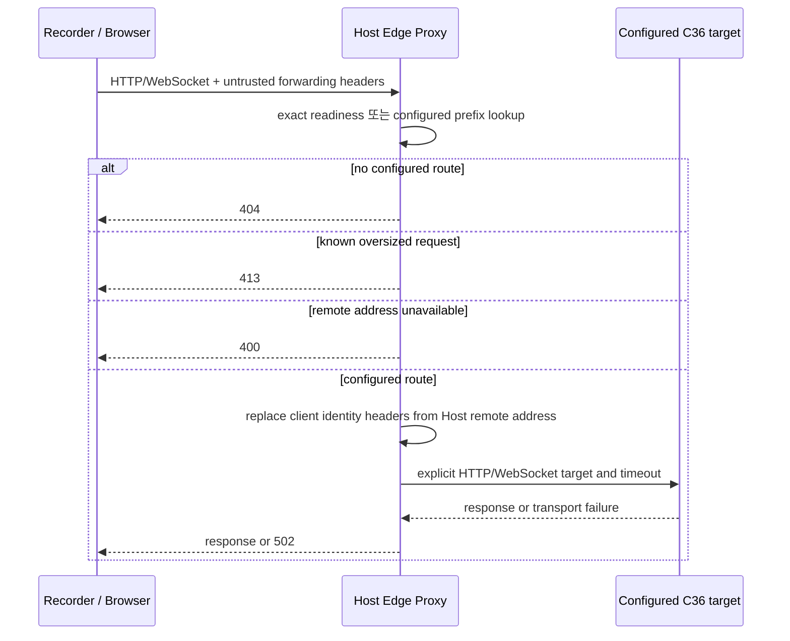

# Host Edge Proxy 경계

> 상태: 구현 완료 — package payload 검증 완료 / OS clean-host listener proof는 pending

`HostEdgeProxy`는 Host가 소유하는 public HTTP/WebSocket trust boundary다. 이 component는
Vital Recorder와 Browser traffic을 **deployment가 명시한 backend**로 전달하고, client가
보낸 forwarding identity를 신뢰하지 않는다. legacy nginx를 vNext runtime dependency로
옮기지 않는다. vNext proxy는 `runtime-platform/services/host-edge-proxy/`의 독립 Go service이며
C36만 시작 input으로 소비한다.

코드 package도 이 owner·boundary·role을 그대로 보존한다.

| package | 역할 | 대표 이름 |
| --- | --- | --- |
| `hostedgeproxydomain` | C36 semantic validation과 explicit route selection의 pure policy | `ValidateHostEdgeProxyDeploymentConfiguration`, `ResolveHostEdgeProxyRoute` |
| `hostedgeproxydeployment` | 하나의 C36 document strict decode | `LoadHostEdgeProxyDeploymentConfiguration` |
| `hostedgeproxyhttpserver` | configured HTTP/WebSocket I/O와 client identity replacement | `NewHostEdgeProxyHTTPHandler` |

`HostEdgeProxyRoute.ConfiguredHTTPUpstreamURL`은 only configured C36 target을
반환한다. generic `TargetURL`이라면 request-derived target인지, service discovery
결과인지, C36 target인지 이름만으로 구분할 수 없다.

## Owner와 책임

| 사실 또는 effect | owner | Host Edge Proxy 역할 | 책임 밖의 일 |
| --- | --- | --- | --- |
| listener·route desired configuration | Host edge proxy deployment | C36을 validate하고 listener bind | Guest IP, upstream URL, proxy port 추측 |
| HTTP/WebSocket forwarding | Host Edge Proxy process | configured route 하나로 request 전달 | Recorder connection/packet/delivery success 판단 |
| client identity trust boundary | Host Edge Proxy process | inbound forwarded identity를 Host remote address로 교체 | client header chain 보존 또는 health state 생성 |
| Guest/upstream health | 해당 Guest service 또는 upstream provider | transport error를 502로 반환 | unavailable을 ready/online으로 승격 |

`/ready`는 **Host Edge Proxy listener가 request를 처리함**만 뜻한다. backend health나
Guest Runtime readiness를 읽지 않는다.

## C36 HostEdgeProxyDeploymentConfiguration

```text
HostEdgeProxyDeploymentConfiguration
  ├─ listener: http + bindHost + port
  ├─ readinessPath
  ├─ clientIdentityHeaderPolicy: replace-with-remote-address
  └─ routes[]
       ├─ requestPathPrefix
       ├─ target: http|https + host + port
       ├─ forwardingProtocol: http-and-websocket
       ├─ requestHostHeaderPolicy: preserve-client-host|target-host
       ├─ maximumRequestBodyBytes
       └─ upstreamResponseHeaderTimeoutMilliseconds
```

Route는 일반적인 `proxy_pass` string이 아니다. `requestPathPrefix`가 긴 route부터
짧은 route 순으로 선언하고, ID와 prefix는 unique해야 한다. 따라서 `/socket.io/`와 `/`
같은 route 겹침의 선택 규칙이 숨은 implementation detail이 되지 않는다. configured
prefix에 맞지 않는 request는 404이며 default backend는 없다.

각 route는 body size와 upstream response-header timeout을 직접 정한다. 큰 `.vital`
upload나 Socket.IO payload를 허용하려면 operator가 C36에서 한도를 선언해야 하며,
`0`, absence, 또는 listener 설정을 unlimited로 해석하지 않는다. `requestHostHeaderPolicy`
도 route 계약이다. application이 public Host header를 contract로 할 때만
`preserve-client-host`를 선택하고, 그렇지 않으면 `target-host`를 사용한다.

## 처리 흐름



Go `httputil.ReverseProxy`는 `X-Forwarded-For`가 없을 때 `request.RemoteAddr`의 한 hop을
쓴다. Proxy는 inbound 값을 먼저 제거하므로 resulting value는 Host-observed remote
client address를 정확히 한 번 가진다. `Forwarded`, `X-Real-IP`, `X-Client-IP`도 같은
Host boundary가 작성한다. 환경변수 proxy는 사용하지 않으며, undeclared environment가
network path를 고를 수 없다.

## macOS package relation

macOS package composer는 C33과 C36을 별도 explicit input으로 받고 다음을 payload에 둔다.

```text
bin/host-agent
bin/host-edge-proxy
config/host-agent-deployment.json        # C33
config/host-edge-proxy-deployment.json   # C36
Library/LaunchDaemons/<host-agent>.plist
Library/LaunchDaemons/<host-edge-proxy>.plist
```

두 launchd label은 달라야 한다. `postinstall`은 두 service를 각각 explicit bootout하고
bootstrap하며 `|| true`로 failure를 숨기지 않는다. Package verifier는 C32/C33/C34/C35 provenance와
external topology가 C35에 남긴 C46 input identity를 보존하고,
Host Agent/proxy binaries, 두 launchd argument, 두 reconciliation line을 검사한다.
이것은 package payload proof일 뿐 package install, listener bind, VM boot, target
reachability를 뜻하지 않는다.

## 아직 증명하지 않는 것

- release-approved C35 Guest artifact에서 Recorder Gateway와 browser/upstream target 기동;
- macOS clean-host install에서 configured public listener bind;
- Recorder Socket.IO/WebSocket traffic이 설치된 proxy를 거쳐 configured Guest target에 도달;
- public Browser/operator control의 TLS와 auth policy.

이 항목은 explicit target profile, C24 clean-host evidence, public-auth contract가 생긴
뒤 증명한다. Proxy fallback으로 채우지 않는다.

## macOS public-route transport contract

macOS NAT에서 C36의 public route는 Guest IP를 target으로 쓰지 않는다. C36, C32,
C37이 각각 다른 책임으로 하나의 named route를 대조한다.

```text
C36 HostEdgeProxyDeploymentConfiguration
  route id=recorder-gateway
  target=http://127.0.0.1:18090
        │
        ▼
C32 GuestPublicServiceHostLocalHTTPBridgeConfiguration
  routeId=recorder-gateway
  Host 127.0.0.1:18090 → Guest AF_VSOCK :18090
        │
        ▼
C37 GuestPublicServiceVirtioSocketBridge
  routeId=recorder-gateway
  Guest AF_VSOCK :18090 → Guest 127.0.0.1:8090
        │
        ▼
Recorder Gateway's own declared TCP listener
```

`routeId`는 port 별칭이 아니라 C36 public capability의 식별자다. C32는 Host-local
accept와 VZ forwarding을, C37은 Guest-loopback TCP target을 소유한다. `HostEdgeProxy`는
오직 C36 route matching과 HTTP/WebSocket forwarding을, `GuestPublicServiceHostLocalHTTPBridge`는
Host byte relay만, `guestpublicservicevirtiobridge`는 Guest byte relay만 수행한다.
어느 계층도 `192.168.*` NAT address를 발견·저장·대체하지 않는다.
