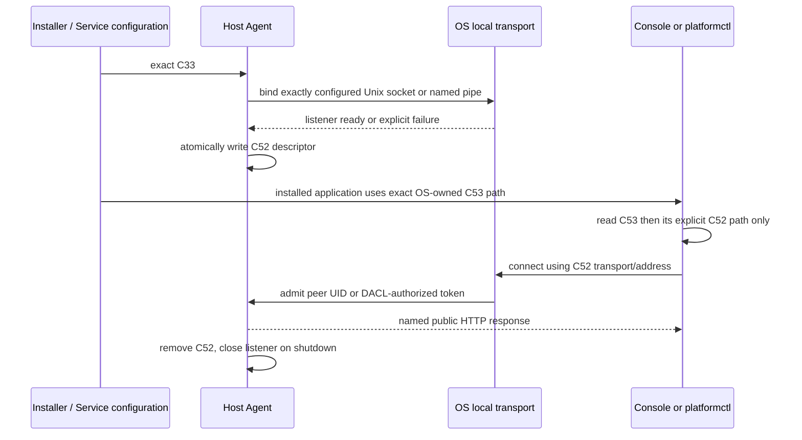

# Host Local Administration Transport Boundary

The Host Agent owns the local operator connection boundary. The Runtime
Console renderer and `platformctl` are consumers; neither owns a port, local
socket, peer identity, Host deployment input, or command transition.

## Explicit documents and state owners

| Contract | Owner | Meaning |
| --- | --- | --- |
| C33 `HostAgentDeploymentConfiguration` | Host deployment administrator | desired local transport, local address, authorization policy, descriptor file path, and optional development loopback listener |
| C52 `HostLocalAdministrationEndpointDescriptor` | Host Agent | public, current listener selection published only after bind succeeds |
| C53 `OperatorInterfaceBootstrapConfiguration` | Host installation configuration | packaged Runtime Console launch input that names exactly the expected C52 descriptor path |
| C7/C8/C2 and Guest facade responses | Host Agent / respective Guest owner | product state returned through the already-versioned HTTP control contract |

C52 intentionally contains only `schemaVersion`, `transport`, and `address`.
It is neither a secret nor authorization evidence. It does not copy C33's
Unix `authorizedUserId`, Windows security descriptor, any deployment path
other than the descriptor's own known path, or a Host/Guest observation.

## Runtime sequence

No arrow implies a fallback. A missing C52, inaccessible descriptor, rejected
peer, invalid response, or unavailable Guest is reported at its own boundary.
The client must not replace any of them with `127.0.0.1`, a remembered port,
an environment variable, or a remote URL.

## Platform adapters

- macOS uses a Unix domain socket. The Host listener obtains `LOCAL_PEERCRED`
  and accepts only the C33 `authorizedUserId`.
- Linux uses a Unix domain socket. The Host listener obtains `SO_PEERCRED` and
  accepts only the C33 `authorizedUserId`.
- Windows uses a service-owned named pipe. `go-winio` supplies the exact C33
  DACL to the Windows kernel when the pipe is created.

On macOS/Linux the socket parent must already be a non-symlink directory owned
by the Host Agent effective user and must not be group- or world-writable.
The Agent does not create it as a convenience fallback. The socket itself may
accept a connection attempt so the Host can inspect peer credentials; a
mismatched peer is closed before it reaches HTTP command handling.

## Development loopback

C33 can separately enable `loopbackHTTP.mode=development-loopback` with a
numeric `127.0.0.1` or `::1` address. This adapter exists for focused
integration fixtures and does not grant per-user authorization. Production
profiles set `loopbackHTTP.mode=disabled`; Host Agent then exposes only its
OS-local administration transport.

## Current delivery gap

The Host/CLI/desktop transport is implemented and cross-compiled. The product
is not yet allowed to claim complete OS release support:

1. macOS needs launchd socket activation or an explicit launcher ownership
   decision plus console-user provisioning of C33 `authorizedUserId`.
2. Windows needs a clean Windows SCM runner to prove the configured DACL
   denies a normal token and admits the intended operator.
3. Linux needs systemd socket activation or an explicit service ownership
   decision plus a polkit/user provisioning decision.
4. The desktop shell now has one reviewed fixed C53 location for each target
   OS. Its package staging contains only bundled application files. The macOS
   arm64 DMG executes with an absent C53 and fails explicitly; Windows arm64
   NSIS and Linux arm64 AppImage package artifacts are built but not executed
   on their native OS. The joined Host+Console clean-host installation still
   must prove that the C47/C48-installed C53 and Host-published C52 are
   readable by the intended console user. Native Windows/Linux authorization
   proof remains delivery work.

Those are delivery and operating-system proof tasks, not reasons for the
Console or CLI to discover another endpoint.
