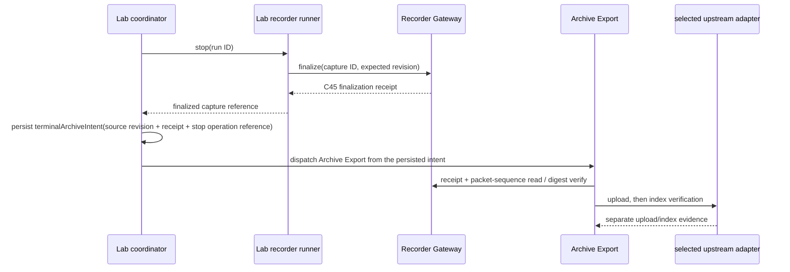

# Lab recorder runner boundary

> 상태: **Runner↔Gateway Socket.IO/HTTP black-box acceptance 구현 완료 / Guest OS boot·systemd runtime proof는 C24 delivery gate에서 계속한다**
>
> 범위: Lab virtual recorder가 실제 Recorder Gateway Socket.IO ingress에
> 연결하고, 정해진 scenario packet을 전송하며, 명시적으로 cold-path capture를
> finalization하는 Guest-local process boundary.

## 왜 별도 service인가

Lab aggregate의 `running`은 의도와 lifecycle 상태이고, Recorder Gateway의
capture는 수신·보존한 packet의 사실이다. 둘을 같은 SQLite row, Gateway
adapter, 또는 UI callback으로 합치면 다음 질문에 답할 수 없게 된다.

- Lab은 실행을 요청했지만 Runner가 Socket.IO 연결을 열지 못했는가?
- packet은 Gateway에 저장됐지만 Lab이 stop transition을 저장하지 못했는가?
- capture는 finalization됐지만 `.vital` 형성·upload·indexing은 어디까지
  진행됐는가?

`lab-recorder-runner`는 이 중 **실행 중인 Socket.IO connection, scenario packet
emission, Gateway finalization HTTP effect**만 수행한다. 그것은 Guest-local
process이며 public Host API나 upstream API가 아니다.

## Owner map

| 사실 | owner | durable source | consumer |
| --- | --- | --- | --- |
| Lab scenario 선택, virtual recorder lifecycle, requested run | Guest Runtime Lab | Guest Runtime SQLite | UI, Archive workflow |
| Runner process의 live Socket.IO connection과 emission timer | Lab recorder runner | process-local effect handle | Guest Runtime Lab coordinator |
| capture ID, retained packets, finalization receipt | Recorder Gateway | Gateway durable state | Archive Export, Runner |
| `.vital` bytes, manifest, upload/indexing receipt | Archive Export | Archive store + Guest Runtime SQLite | UI, retention workflow |

Runner는 Gateway capture나 Archive artifact를 소유하지 않는다. Lab은
connection/socket state를 자체적으로 만들지 않는다. Archive Export는 Runner
timer·socket·scenario를 직접 읽지 않는다.

Runner program과 scenario catalog은 C37의 process intent와 별개인 release
payload이다. Guest Node Services Bundle이 `/opt/vitalserver`에 Node runtime,
Gateway, Runner, catalog을 함께 설치하며, C40은 C37의 Runner program/catalog
path가 그 bundle의 exact path와 일치하지 않으면 Guest bootstrap을 거부한다.
자세한 packaging contract는
[Guest Node Services Bundle Boundary](guest-node-services-bundle-boundary.md)를
참조한다.

## Guest-local contracts

Runner는 declared Guest-loopback listener에서만 다음 command/effect boundary를
제공한다.

| command | precondition | explicit result |
| --- | --- | --- |
| `POST /v1/lab-recorder-runs` | valid runner request + supported scenario + Gateway join acknowledgement | `running` run with Gateway recorder ID and capture ID, or typed rejection/failure |
| `POST /v1/lab-recorder-runs/{id}:stop` | exact active run | Gateway finalization receipt reference, or typed rejection/failure |
| `GET /v1/lab-recorder-runs/{id}` | valid run reference | Runner-owned live effect observation; a missing process state is not a stopped Lab resource |

The Runner’s start command uses the `recorderGatewayRecorderCode` supplied by
Lab orchestration. Its resulting Gateway identifier is explicit
`recorder-<code>` because that is the current Socket.IO adapter contract. No
other component derives that identity from a display name.

The first implementation keeps live connection handles in the Runner process.
It does **not** introduce a new JSON state store: Lab’s desired run and
operation records stay in the existing Guest Runtime SQLite owner. A Runner
restart therefore produces an explicit unavailable/missing live-effect answer;
it never silently reports a stopped recorder or creates a replacement capture.

## Stop and archive sequence

`stop` is not upload success. A complete operator action is ordered as:

The Lab operation records only the Runner lifecycle transition. The Runner's
`archiveOnTerminalStop` policy is persisted as either `export-on-stop` or
`no-export`; a missing policy is not decoded as `false`. For `export-on-stop`,
Lab persists a pending terminal archive intent before Archive is asked to act.
Archive Export has its own operation and receipt. An upload failure or unknown
outcome does not rewrite `LabSession` from `stopped` to a fabricated execution
state.

If Guest Runtime restarts between terminal finalization and Archive dispatch,
it replays only that durable intent with its original request ID. The intent
also names the completed Lab stop operation needed to record dispatch evidence;
restart recovery never constructs an operation from a runner log or an absent
socket handle.

## Scenario contract

Runner accepts a named scenario ID and maps it through a declared scenario
catalog. Catalog entries must declare a waveform fixture, packet interval,
minimum packet count before finalization, and whether an Archive workflow is
requested after a terminal stop. Scenario text, filenames, packet count, and
upload policy are never inferred from a display name.

## Acceptance requirements

`acceptance.harness.test_lab_recorder_runner_gateway` starts the real Runner
and Gateway Node entrypoints, joins a real Recorder Gateway Socket.IO session,
checks accepted scenario packet ingress, stops the exact Runner-owned run, and
verifies the public packet-sequence digest against the Gateway finalization
receipt. It also observes the Runner's C19 publication request at the named
Guest Runtime catalog boundary. The separate Lab/Archive orchestration test
proves that this finalization receipt becomes an artifact-formation input rather
than a fixture-only substitute.
