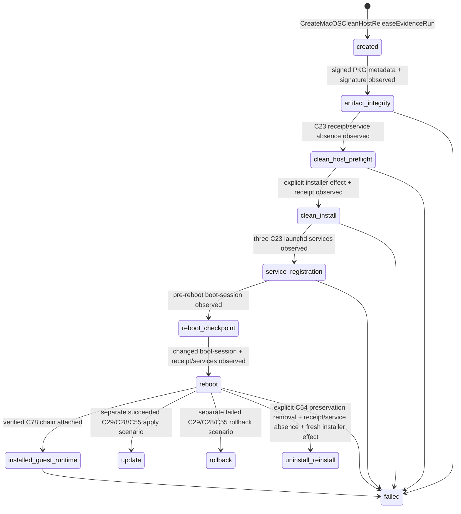

# macOS Clean-Host Release Evidence Boundary

> 상태: **runner와 deterministic command-contract test 구현 완료 / 실제 clean-Host evidence는 아직 없음**

## 1. 문제와 책임 분리

PKG가 build 또는 payload verification을 통과했다고 해서 clean macOS Host에 설치되었거나
재부팅 뒤 launchd service가 살아 있다는 뜻은 아니다. 이 둘은 다른 owner의 사실이다.

| 사실 | owner | durable form | 성공으로 오해하면 안 되는 것 |
| --- | --- | --- | --- |
| 어떤 release가 어떤 PKG identifier/name/version을 의도하는가 | Release process | C23 `ReleaseDeliveryPlan` | 실제 PKG 존재·서명·설치 |
| PKG payload와 C32–C39/C44 provenance 및 external-topology C46 input identity | Package composer/verifier | build result | clean Host installation |
| 한 clean Host run의 단계/증거 | `MacOSCleanHostReleaseEvidenceJournal` | runner-owned SQLite | Host Agent/Guest Runtime runtime state |
| PKG receipt와 launchd registration의 실제 현재 사실 | macOS `pkgutil` / `launchctl` | command observation | Guest VM start/readiness |
| 설치된 Guest의 first boot, Recorder upload lineage, reboot identity | C78 Guest installed-runtime runner | 세 immutable C78 document | PKG receipt·process/log 존재 |
| release proof | Release process | C24 `ReleaseDeliveryProofSet` | Host/Guest domain state |

`tooling/macos_clean_host_release_evidence_runner.py`는 위 표의 세 번째 행만
소유한다. `MacOSCleanHostReleaseEvidenceCommandContract`는 `pkgutil`, `installer`,
`launchctl`, `sysctl`의 절대 executable path를 한 evidence run에 고정하는 **외부 command
계약**이며, Host runtime 환경이나 lifecycle state가 아니다. Host Agent SQLite, Guest
Runtime SQLite, `launchd`, installer receipt를 직접 state로 재구성하지 않는다. 각 external
command의 raw stdout/stderr와 return code를 evidence document로 보존하고, 검증 가능한
경우에만 C24 proof fragment를 만든다.

The C23 `macOSInstallerSignaturePolicy` makes the required PKG signature state
explicit for each release: `unsigned` requires `pkgutil` to report `Status: no
signature`, while `developer-id` requires an accepted Apple Developer ID
Installer signature. The unsigned policy does not infer trust from a package
filename or an `installer` exit code: the runner binds the observed SHA-256,
PKG identifier, and version before any installation effect. Operators must
obtain that immutable artifact through an authenticated delivery channel.

The separate `MacOSDevelopmentInstallationEvidenceRunner` remains useful for
ad-hoc Virtualization-entitled Supervisor development installs. Its evidence
does not create C24 proof, Developer ID identity, or notarization.

## 2. 용어와 release identity

macOS release identity는 C23에서 다음처럼 명시된다.

```text
ReleaseDeliveryPlan
  ├─ productVersion
  ├─ intendedInstallerArtifact(kind=pkg, expectedName)
  ├─ macOSInstallerPackageIdentifier
  ├─ macOSInstallerSignaturePolicy(unsigned | developer-id)
  └─ requiredHostServiceRegistrations
       ├─ host-agent / launchd / label
       └─ host-edge-proxy / launchd / label
```

`macOSInstallerPackageIdentifier`는 filename이나 data directory에서 추론하지 않는다.
이 값은 `pkgbuild --identifier`, expanded PKG `PackageInfo.identifier`, 그리고 clean
Host의 `pkgutil --pkg-info <identifier>` receipt query가 모두 같은 대상을 말하게 하는
release-process-owned fact다.

C24 clean-install이 `verified`라면 `ObservedInstallerArtifact`뿐 아니라
`ObservedMacOSInstallerReceipt(packageIdentifier, productVersion,
receiptState=installed)`도 반드시 가진다. artifact digest는 선택한 bytes의 관측이고,
receipt는 installer effect 이후 Host가 등록한 package identity의 관측이다. 둘 중 어느
하나도 다른 하나에서 만들어 내지 않는다.

## 3. Evidence run 상태 기계



각 stage는 journal에서 한 번만 기록된다. 실패한 command를 다른 output으로 재시도해
같은 run을 성공으로 고쳐 쓰지 않는다. 수정된 artifact, clean하지 않은 machine,
권한/command 문제를 고친 뒤에는 새 run ID와 새 evidence directory를 사용한다. 이는
실패 evidence가 사라지는 것을 막고, “어느 bytes와 어느 Host 상태를 확인했는가”를
재현 가능하게 한다.

`reboot-checkpoint`는 reboot effect가 아니다. runner는 `kern.bootsessionuuid`를
checkpoint로 persist하고 종료한다. 운영자가 실제 reboot를 수행한 뒤 `record-reboot`를
실행하면, 값이 바뀌었는지와 receipt/세 service가 남아 있는지를 관측한다. 따라서
release tooling이 개발자 Mac을 몰래 재부팅하거나, process uptime만 보고 reboot를
추정하지 않는다.

## 4. command boundary와 failure 의미

| operation | explicit macOS command | verified 조건 | ambiguous/non-zero 처리 |
| --- | --- | --- | --- |
| artifact integrity | `pkgutil --expand <PKG> <temporary directory>`로 expanded `PackageInfo`를 읽고, `pkgutil --check-signature <PKG>` 실행 | C23 package identifier/version과 일치하고 C23 policy가 `unsigned`이면 `Status: no signature`, `developer-id`이면 `Status: signed` 관측 | C24 `artifact-integrity=failed` |
| clean preflight | `pkgutil --pkg-info <C23 identifier>`, `launchctl print system/<C23 label>` | receipt와 세 service 모두 명시적으로 absent | unknown command failure는 absent가 아니라 failed |
| install | `installer -pkg <bound PKG> -target /` | explicit root process에서 installer success 후 exact receipt observed | C24 `clean-install=failed` |
| service registration | 세 `launchctl print` | 세 C23 label 모두 registered | C24 `service-registration=failed` |
| reboot | `sysctl -n kern.bootsessionuuid` + receipt/service checks | checkpoint와 다른 boot session, receipt/service retained | C24 `reboot=failed` |
| installed Guest runtime | caller-selected C78 first-boot/direct-upload/post-reboot documents + canonical contract repository | 세 문서가 모두 contract-valid/verified이고 같은 C23 plan·runner를 명시하며, evidence ID chain·changed boot session·C77 owner identity가 일치 | C24 `installed-guest-runtime=failed`; runner는 Guest state를 다시 탐색하지 않음 |
| update | explicit C23 + C29/C55/C48/C49 paths, then `pkgutil`/`launchctl` | succeeded C29/C28/C55 apply and C48/C49 facts agree with fresh native receipt/services | C24 `update=failed`; command never executes an update |
| rollback | explicit C23 + failed C29/C28/C55 rollback/C48/C49 paths, then `pkgutil`/`launchctl` | restored C48 version and native receipt/services agree | C24 `rollback=failed`; one journal cannot contain both update and rollback scenarios |
| uninstall/reinstall | installed `host-installation-manager --mode remove` + `pkgutil`/`launchctl` + `installer` | C54 `preserve-mutable-data` receipt has the exact installation/release IDs, manager-owned receipt removal, C23 receipt/service absence, then exact bound PKG receipt/service recovery | C54 receipt failure, non-zero remove, ambiguous absence, or failed reinstall is C24 `uninstall-reinstall=failed`; reinstall is not executed after a failed removal proof |

macOS `pkgutil --pkg-info`는 설치된 receipt만 읽는다. 따라서 runner는 설치 전 flat
PKG의 release identity를 filename에서 추정하지 않고, `pkgutil --expand` 결과의
`PackageInfo.identifier`와 `PackageInfo.version`으로 관측한다. 이 runner가 서명 없는 dev
PKG를 정책 없이 `verified`로 만들 수는 없다. C23가 명시적으로 `unsigned`을 선택한
경우에만 `Status: no signature`을 artifact identity로 받아들이고, 그 외에는
Developer ID status를 요구한다. `pkgutil` exit code만 보지 않고 policy에 해당하는
signature output을 확인한다. 또한 launchctl/pkgutil의
임의 non-zero를 absence로 바꾸지 않는다. macOS가 명시적으로 “receipt/service 없음”을
보고한 경우에만 clean-host preflight의 absent fact가 된다.

## 5. 운영 절차

다음 예시는 directory와 executable을 모두 명시한다. runner는 data path, package
identifier, service label, installer path를 default로 선택하지 않는다.

```sh
mkdir -p /absolute/evidence/macos-020

python3 -m tooling.macos_clean_host_release_evidence_runner create-run \
  --journal-path /absolute/evidence/macos-020/release-evidence.sqlite \
  --evidence-directory /absolute/evidence/macos-020 \
  --installer-artifact /absolute/release/VitalServerRuntimePlatform-0.2.0-dev.pkg \
  --release-delivery-plans-document /absolute/source/runtime-platform/product/delivery/release-delivery-plans.v1.json \
  --release-delivery-plan-id macos-runtime-platform-release \
  --run-id macos-clean-host-020 \
  --runner-id macos-clean-host-runner-01 \
  --pkgutil-executable /usr/sbin/pkgutil \
  --installer-executable /usr/sbin/installer \
  --launchctl-executable /bin/launchctl \
  --sysctl-executable /usr/sbin/sysctl

python3 -m tooling.macos_clean_host_release_evidence_runner record-artifact-integrity \
  --journal-path /absolute/evidence/macos-020/release-evidence.sqlite
python3 -m tooling.macos_clean_host_release_evidence_runner record-clean-host-preflight \
  --journal-path /absolute/evidence/macos-020/release-evidence.sqlite
sudo python3 -m tooling.macos_clean_host_release_evidence_runner execute-clean-install \
  --journal-path /absolute/evidence/macos-020/release-evidence.sqlite \
  --authorize-clean-install
python3 -m tooling.macos_clean_host_release_evidence_runner record-service-registration \
  --journal-path /absolute/evidence/macos-020/release-evidence.sqlite
python3 -m tooling.macos_clean_host_release_evidence_runner record-reboot-checkpoint \
  --journal-path /absolute/evidence/macos-020/release-evidence.sqlite
# Operator performs the actual reboot here.
python3 -m tooling.macos_clean_host_release_evidence_runner record-reboot \
  --journal-path /absolute/evidence/macos-020/release-evidence.sqlite

# C78 runner가 같은 runner ID로 발행한 세 immutable document만 결속한다.
python3 -m tooling.macos_clean_host_release_evidence_runner record-installed-guest-runtime \
  --journal-path /absolute/evidence/macos-020/release-evidence.sqlite \
  --contract-root /absolute/source/runtime-platform \
  --first-boot-evidence /absolute/evidence/c78/first-boot-checkpoint.json \
  --direct-upload-evidence /absolute/evidence/c78/direct-upload-lineage.json \
  --post-reboot-evidence /absolute/evidence/c78/post-reboot-identity.json

# Run this only after the staged updater has already produced C29/C28/C55 and
# Host Installation Manager has produced fresh C48/C49 facts. It records
# evidence; it does not execute the update.
python3 -m tooling.macos_clean_host_release_evidence_runner record-host-platform-update \
  --journal-path /absolute/evidence/macos-020/release-evidence.sqlite \
  --release-delivery-plans-document /absolute/source/runtime-platform/product/delivery/release-delivery-plans.v1.json \
  --host-update-journal /absolute/evidence/update/current-journal.json \
  --host-platform-effect-receipt /absolute/evidence/update/host-platform-apply.json \
  --host-installation-manifest /Library/Application\ Support/VitalServerRuntimePlatform/current/installation-manifest.json \
  --host-installation-footprint /absolute/evidence/update/installation-footprint.json

# All paths and identities below are caller-supplied C48/C50/C54 facts. The
# runner does not derive them from the selected package, current symlink, or
# mutable data directory.
sudo python3 -m tooling.macos_clean_host_release_evidence_runner execute-uninstall-reinstall-preserving-data \
  --journal-path /absolute/evidence/macos-020/release-evidence.sqlite \
  --host-installation-manager /Library/Application\ Support/VitalServerRuntimePlatform/current/bin/host-installation-manager \
  --installed-manifest /Library/Application\ Support/VitalServerRuntimePlatform/current/installation-manifest.json \
  --installation-journal /Library/Application\ Support/VitalServerRuntimePlatform/data/installation-manager/current-transaction.json \
  --installation-receipt /Library/Application\ Support/VitalServerRuntimePlatform/data/installation-manager/latest-installation-receipt.json \
  --removal-journal /Library/Application\ Support/VitalServerRuntimePlatform/data/installation-manager/c24-removal-020.json \
  --removal-receipt /Library/Application\ Support/VitalServerRuntimePlatform/data/installation-manager/c24-removal-020-receipt.json \
  --removal-request-id c24-removal-020 \
  --expected-installation-id vitalserver-runtime-platform-macos-reference \
  --expected-release-id macos-release-assembly-020 \
  --authorize-uninstall-reinstall
```

`write-stage-proof-fragment --stage <C24 stage> --output-proof-fragment <new absolute file>`는
runner-owned C24 record를 새 immutable fragment file로 한 번만 발행한다.
`print-stage-proof`는 사람이 읽을 stdout view만 제공한다. Release process는 evidence와
fragment를 review한 뒤 C74
`release_delivery_proof_attachment.py`로 새 immutable C24 candidate에만 attach한다.
source tree의 `release-delivery-proofs.v1.json`은 자동으로 수정하지 않는다. local
machine observation과 reviewed release declaration의 owner가 다르기 때문이다. C74의
evidence SHA-256 재검증과 candidate gate 절차는 [Release Delivery Proof Attachment
Boundary](release-delivery-proof-attachment-boundary.md)를 따른다.

`uninstall/reinstall`은 runner가 C54 preservation flow로 수행할 수 있다.
`record-host-platform-update`와 `record-host-platform-rollback`은 각각 existing
staged-update result를 fresh native observation과 결합한다. apply와 rollback은
서로 배타적인 C29 terminal outcome이므로 별도 run에서 수집해야 한다. SBOM/notices와
실제 clean-Host capture/review는 여전히 release-process work다. 따라서 checked-in
C24 record는 계속 `pending`이고 `make release-ready`도 실패해야 한다. 이것은 미완료
release evidence를 성공처럼 보이지 않게 하는 정상 동작이다.

## 6. 테스트와 실제 proof의 차이

`tooling/tests/test_macos_clean_host_release_evidence_runner.py`는 fake command result로
다음을 검증한다.

1. C23-policy-matched package metadata → explicit absent preflight → root installer effect → exact receipt →
   three launchd registrations → changed boot session의 전체 transition;
2. 모호한 `launchctl` failure가 service absence가 되지 않는 규칙;
3. run 생성 후 PKG bytes가 바뀌면 동일 release evidence로 사용하지 않는 규칙;
4. stage evidence가 overwrite되지 않는 규칙;
5. C54 receipt/receipt absence/service absence를 모두 확인한 뒤에만 재설치하는 규칙,
   그리고 C54 receipt가 invalid이면 재설치를 수행하지 않는 규칙;
6. C78 세 문서가 같은 plan/runner/evidence chain, changed boot session과 동일한
   C77 SQLite/PostgreSQL/bootstrap identity를 제공할 때만 별도
   `installed-guest-runtime` C24 stage가 verified가 되는 규칙.

이는 runner의 decision/recording contract proof다. 실제 C23 policy에 맞는 PKG, clean
Host, launchd, reboot evidence가 C24에 attach되기 전에는 제품 설치 proof가 아니다.
