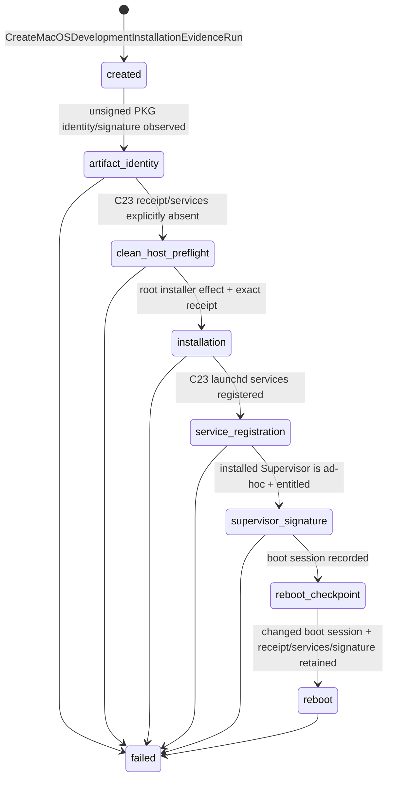

# macOS Development Installation Evidence Boundary

> 상태: **unsigned PKG + ad-hoc Virtualization-entitled Supervisor를 위한 runner와 deterministic command-contract test 구현 완료 / Apple Developer ID release proof(C24)는 별도 pending**

## 1. 왜 release proof와 분리하는가

개발자는 Apple Developer ID certificate, notarization, 또는 배포용 clean Host를 아직
준비하지 않은 상태에서도 실제 macOS Installer, launchd, 재부팅, 그리고
`VZVirtualMachine` entitlement 경로를 검증할 수 있어야 한다. 그러나 그 결과를
"배포 가능한 release"라고 부르면 안 된다. unsigned Installer package와 ad-hoc Mach-O
signature는 Developer ID Installer package/Developer ID Application signature와 다른
macOS artifact다.

따라서 다음 두 evidence chain은 서로 상태나 성공 결과를 공유하지 않는다.

| evidence chain | owner | artifact policy | durable journal | 증명하는 것 | 증명하지 않는 것 |
| --- | --- | --- | --- | --- | --- |
| Development installation | `MacOSDevelopmentInstallationEvidenceRunner` | unsigned PKG + ad-hoc Supervisor + `com.apple.security.virtualization=true` | development-installation SQLite | local controlled installation, service registration, reboot retention, installed Supervisor entitlement | Apple identity, notarization, C24 release delivery, Guest readiness |
| Release clean-Host | `MacOSCleanHostReleaseEvidenceRunner` | Developer ID PKG + Developer ID Supervisor | C24 release-evidence SQLite | reviewed release package의 clean-Host install/reboot fact와 C24 proof fragments | development journal의 성공 또는 Guest readiness |

둘 다 macOS external fact는 `pkgutil`, `installer`, `launchctl`, `codesign`, `sysctl`의
raw command observation으로만 읽는다. `macos_host_installation_observation.py`는 그
adapter다. 이 adapter는 release/development state machine을 소유하지 않으며, callers가
각자의 policy와 journal에 관측을 적용한다.

## 2. 명시적인 signing policy

`MacOSReleasePackageAssemblyDeclaration`은 Installer package와 VM Supervisor의 signing
policy를 의도적으로 분리한다.

| artifact | allowed mode | 의미 |
| --- | --- | --- |
| Installer package | `unsigned`, `developer-id` | unsigned는 development installation 전용이고, `developer-id`만 release distribution input이다. `developer-id` identity는 `Developer ID Installer: ...`로 명시한다. PKG에는 ad-hoc mode가 없다. |
| macOS Virtual Machine Supervisor | `unsigned`, `ad-hoc`, `developer-id` | `ad-hoc`은 controlled local development 용도이며 named identity가 없어야 한다. `developer-id`는 `Developer ID Application: ...` identity, hardened runtime, timestamp를 요구한다. |

development build의 유효한 조합은 다음 하나다.

```text
Installer package = unsigned
VM Supervisor    = ad-hoc + com.apple.security.virtualization=true
```

release build의 유효한 조합은 다음 하나다.

```text
Installer package = developer-id
VM Supervisor    = developer-id + com.apple.security.virtualization=true
```

`developer-id` PKG가 `ad-hoc` 또는 `unsigned` Supervisor를 담는 것은 허용하지 않는다.
반대로 unsigned PKG가 ad-hoc Supervisor를 담는 것은 개발 evidence에서 명시적으로
검증한다. `signed`처럼 issuer가 드러나지 않는 mode 이름은 사용하지 않는다.

## 3. Development installation 상태 기계



각 stage는 `MacOSDevelopmentInstallationEvidenceJournal`에 한 번만 기록한다. artifact
bytes, package receipt, service absence, package signature, 또는 installed binary signature가
불명확하면 성공으로 보정하지 않는다. 문제가 고쳐진 뒤에는 새 run ID, 새 journal, 새
evidence directory를 사용한다.

`reboot-checkpoint`는 reboot command가 아니다. runner는 `kern.bootsessionuuid`를
durably 기록하고 종료한다. 운영자가 실제 reboot를 수행한 뒤 `record-reboot`를 호출해야
새 boot session, exact package receipt, declared service registration, ad-hoc signature와
virtualization entitlement가 다시 관측된다.

## 4. command contract와 stage guard

| stage | external observation/effect | verified guard | failed/unavailable 의미 |
| --- | --- | --- | --- |
| `artifact-identity` | `pkgutil --expand`, `pkgutil --check-signature` | C23 identifier/version와 일치하고 `Status: no signature` | signed/unknown/invalid PKG는 development evidence가 아님 |
| `clean-host-preflight` | `pkgutil --pkg-info`, `launchctl print` | receipt와 두 C23 service가 명시적으로 absent | 임의 non-zero는 absence가 아님 |
| `installation` | root `installer -pkg <bound PKG> -target /` | installer success 후 exact C23 receipt installed | artifact mutation 또는 receipt mismatch |
| `service-registration` | `launchctl print system/<C23 label>` | Host Agent와 Host Edge Proxy 모두 registered | service state를 runtime readiness로 해석하지 않음 |
| `supervisor-signature` | `codesign --verify/--display/--entitlements` | installed Supervisor가 ad-hoc이고 entitlement가 present | Developer ID, unsigned, unknown-signed, missing entitlement 모두 실패 |
| `reboot` | `sysctl` + receipt/service/signature 재관측 | boot session 변화와 install facts 유지 | process uptime으로 reboot를 추정하지 않음 |

macOS `pkgutil --check-signature`는 unsigned flat PKG에 `Status: no signature`를
명시하면서 exit status `1`을 반환할 수 있다. development runner는 이 명시적 status line을
signature-state fact로 보존한다. 따라서 이 경우 return code `1`은 command transport
failure가 아니라 unsigned state의 raw observation이다. 반대로 `Status: no signature`가 없는
non-zero result는 unavailable이며 unsigned로 추정하지 않는다.

`--authorize-development-installation`은 installer effect를 별도 승인한다. runner는
install, reboot, clean-up, uninstall을 자동으로 수행하지 않는다. clean preflight는
기존 제품 설치 여부를 검사할 뿐, 이미 설치된 product를 삭제하지 않는다.

## 5. 운영 절차

아래는 C47 build output을 대상으로 하는 development evidence 절차다. path와 executable은
모두 operator가 명시하며, runner는 기본 data path나 package name을 선택하지 않는다.

```sh
mkdir -p /absolute/evidence/macos-development-001

python3 -m tooling.macos_development_installation_evidence_runner create-run \
  --journal-path /absolute/evidence/macos-development-001/development-installation.sqlite \
  --evidence-directory /absolute/evidence/macos-development-001 \
  --installer-artifact /absolute/release/VitalServerRuntimePlatform-0.2.0-dev.pkg \
  --installed-virtual-machine-supervisor "/Library/Application Support/VitalServerRuntimePlatform/current/bin/macos-virtual-machine-supervisor" \
  --release-delivery-plans-document /absolute/source/runtime-platform/product/delivery/release-delivery-plans.v1.json \
  --release-delivery-plan-id macos-runtime-platform-release \
  --run-id macos-development-installation-001 \
  --runner-id macos-development-runner-01 \
  --pkgutil-executable /usr/sbin/pkgutil \
  --installer-executable /usr/sbin/installer \
  --launchctl-executable /bin/launchctl \
  --codesign-executable /usr/bin/codesign \
  --sysctl-executable /usr/sbin/sysctl

python3 -m tooling.macos_development_installation_evidence_runner record-artifact-identity \
  --journal-path /absolute/evidence/macos-development-001/development-installation.sqlite
python3 -m tooling.macos_development_installation_evidence_runner record-clean-host-preflight \
  --journal-path /absolute/evidence/macos-development-001/development-installation.sqlite
sudo python3 -m tooling.macos_development_installation_evidence_runner execute-installation \
  --journal-path /absolute/evidence/macos-development-001/development-installation.sqlite \
  --authorize-development-installation
python3 -m tooling.macos_development_installation_evidence_runner record-service-registration \
  --journal-path /absolute/evidence/macos-development-001/development-installation.sqlite
python3 -m tooling.macos_development_installation_evidence_runner record-supervisor-signature \
  --journal-path /absolute/evidence/macos-development-001/development-installation.sqlite
python3 -m tooling.macos_development_installation_evidence_runner record-reboot-checkpoint \
  --journal-path /absolute/evidence/macos-development-001/development-installation.sqlite
# Operator performs the actual reboot here.
python3 -m tooling.macos_development_installation_evidence_runner record-reboot \
  --journal-path /absolute/evidence/macos-development-001/development-installation.sqlite
```

이 journal과 JSON evidence는 local development verification 자료다. C24
`ReleaseDeliveryProofSet`에 attach하지 않으며 `make release-ready`의 pending 상태를 바꾸지
않는다. Developer ID identity와 notarization을 준비한 뒤에는 별도 C24 clean-Host runner를
처음부터 수행한다.

## 6. deterministic test와 native evidence의 차이

`tooling/tests/test_macos_development_installation_evidence_runner.py`는 fake macOS command
contract로 다음을 확인한다.

1. unsigned package + ad-hoc entitled Supervisor의 full transition;
2. signed package가 unsigned development evidence로 바뀌지 않는 guard;
3. Developer ID Supervisor가 ad-hoc evidence로 바뀌지 않는 guard;
4. run 생성 뒤 package bytes가 바뀌면 stage를 기록하지 않는 guard.

이는 runner의 state/policy/recording contract proof다. 실제 native Host에서 위 절차를
수행하기 전에는 local install/reboot evidence가 존재하지 않는다. 실제 evidence가
있더라도 Apple distribution release proof는 아니며, C24는 계속 별도 owner로 남는다.

관련 문서: [macOS Release Package Assembly](macos-release-package-assembly-boundary.md),
[macOS Clean-Host Release Evidence](macos-clean-host-release-evidence-boundary.md),
및 [macOS Virtual Machine Supervisor](macos-virtual-machine-supervisor-boundary.md).
