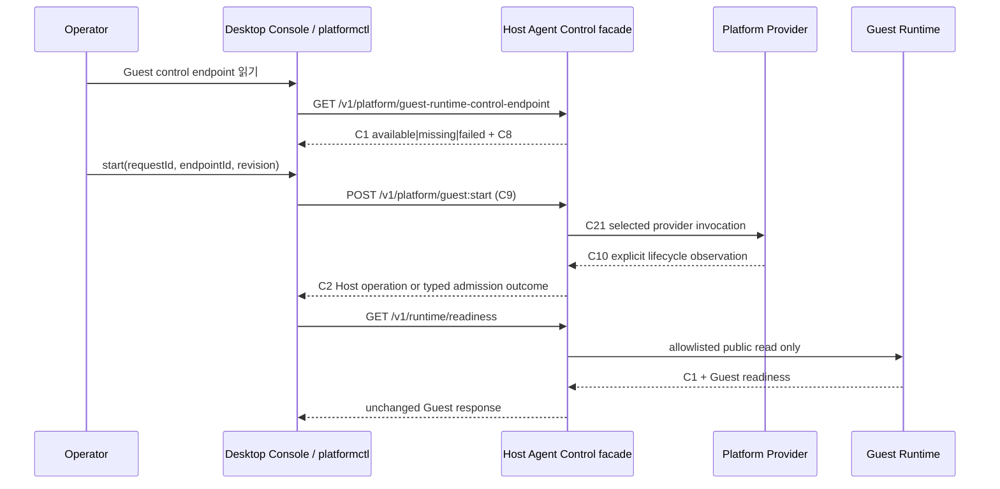

# Operator Control Surface

> 상태: **C52 local-administration transport, `platformctl`, Electron main/preload transport, Lab·external-upstream·topology·NTP·OTLP·C69 update named control requests, C71 Console package receipt, C72 Host+Console delivery kit, and C47/C48 unified macOS PKG application-bundle composition implemented / joined clean-host proof and native OS execution proof pending**

Runtime Platform은 GUI를 만들기 전에, 운영자가 어느 state owner에게 어떤
명령을 요청하는지 명확하게 보여 주는 하나의 control surface를 만든다. 이
문서는 desktop console, browser console, headless CLI가 같은 public contract를
소비하도록 고정하는 경계다.

이 경계는 화면을 위해 새로운 제품 상태를 만들지 않는다. 설치·Host lifecycle은
Host Agent가, runtime/Lab/archive는 Guest Runtime이, ingress/delivery receipt는
Recorder Gateway가 각각 계속 소유한다. console과 CLI는 owner가 돌려준
`ReadResult`, `Operation`, receipt를 표시하고 command를 요청할 뿐이다.

## 1. Operator가 보는 흐름



`start` accepted와 Guest `readiness=ready`는 같은 뜻이 아니다. 첫 번째는
Host가 provider effect를 durable operation으로 받아들였다는 사실이고, 두 번째는
Guest service owner가 준비 상태를 발표했다는 사실이다. Console/CLI는 이 둘을
합쳐서 녹색 상태를 만들면 안 된다.

## 2. 역할과 책임

| 구성요소 | 소유하는 것 | 하는 일 | 하면 안 되는 일 |
| --- | --- | --- | --- |
| **Runtime Console renderer** | 창·탭·filter·draft 같은 UI-local 상태 | owner response format, operator input collect, operation follow | Host/Guest state 추론, database/file access, transition policy |
| **Desktop shell** | native window, tray, notification, OS lifecycle | renderer를 최소 권한으로 host-local control transport에 연결 | SQLite/launchd/SCM/systemd/VM 직접 호출 |
| **`platformctl`** | process argument와 output only | named public HTTP contract request/response display | endpoint discovery, retry/idempotency key 생성, domain state cache |
| **Host Agent** | C7 installation, C8 control endpoint, C2 Host operation | Host lifecycle/update/time/telemetry orchestration, Guest facade allowlist | Guest DB/files/log read, Guest state rewrite |
| **Guest Runtime** | topology, readiness, Lab, archive, external upstream and Guest operations | Guest-owned product command/read | Host provider or OS-service control |

Console와 CLI는 **같은 command availability rule을 source code로 복제하지
않는다**. Command button/CLI usage는 response의 explicit state와 version/revision을
표시하고, ultimate command admission은 Host/Guest owner가 수행한다. disabled UI는
편의를 위한 rendering일 뿐, authorization 또는 lifecycle policy의 source가 아니다.

## 3. Public control API 사용 규칙

첫 실행 범위는 이미 versioned된 contract를 그대로 사용한다.

| Operator intent | Public route | owner-supplied result |
| --- | --- | --- |
| Host installation 보기 | `GET /v1/platform/installation` | C1<C7> |
| Guest control endpoint 보기 | `GET /v1/platform/guest-runtime-control-endpoint` | C1<C8> |
| Guest start/stop/reboot 요청 | `POST /v1/platform/guest:{action}` with C9 | C2, C12 또는 command rejection |
| Host/Guest operation 보기 | `GET /v1/platform/operations/{id}` / `GET /v1/runtime/operations/{id}` | C1<C2> |
| Guest readiness/topology/capability 보기 | `/v1/runtime/{readiness|topology|capabilities}` | Guest C1 response unchanged |
| Host/Guest NTP quality 보기 | `/v1/platform/time/clock-quality`, `/v1/time/clock-quality` | 각 node owner의 ClockQuality C1 |
| Host/Guest NTP authority 적용 | `POST /v1/platform/time/authorities`, `POST /v1/time/authorities` with `TimeAuthorityApplyCommand` | 각 owner의 operation 또는 typed admission outcome |
| Host/Guest OTLP pipeline 적용 | `POST /v1/platform/telemetry/pipelines`, `POST /v1/runtime/telemetry/pipelines` with `TelemetryPipelineApplyCommand` | 각 owner의 operation 또는 typed admission outcome |
| Lab·Vital Recorder 관측 보기 | `/v1/runtime/lab/{sessions|beds|recorders}`, `/v1/runtime/catalog/recorder-observations` | Guest-owned list C1 response unchanged |
| Lab session 생성 | `POST /v1/runtime/lab/sessions` with `CreateLabSessionCommand` | Guest Lab operation 또는 typed admission outcome |
| Lab resource lifecycle | `POST /v1/runtime/lab/resources:command` with `LabResourceCommand` | Guest Lab operation 또는 typed admission outcome |
| Archive Export provider 보기 | `GET /v1/runtime/archive/export-provider` | Archive owner가 공개한 provider reference C1; endpoint·secret·export outcome은 아님 |
| stopped Lab recorder artifact export 요청 | `POST /v1/runtime/archive/exports` with `ArtifactExportCommand` | Archive operation 또는 typed admission outcome |
| 외부 upstream·relay 보기 | `/v1/runtime/{external-upstreams|relay-targets}` | Guest-owned list C1 response unchanged |
| 외부 VitalServer integration 적용 | `POST /v1/runtime/external-upstreams` with `ExternalUpstreamApplyCommand` | Guest external-upstream operation 또는 typed admission outcome |
| Runtime topology 적용 | `POST /v1/runtime/topology:apply` with `TopologyApplyCommand` | Guest topology operation 또는 typed admission outcome |
| offline product update 가져오기/적용 | `POST /v1/platform/update-bundles:import`, `POST /v1/platform/update-bundles/{id}:apply` | Host C69 receipt, 이어지는 C27/C29 operation |

Desktop Console과 `platformctl`은 위의 read vocabulary와 Lab, external-upstream,
topology, NTP, OTLP, update의 named command를 제공한다. 두 도구가 `lab-sessions`나
`recorder-observations`을 임의 URL로 조합하거나 SQLite를 읽는 방식은 허용하지 않는다.
generic "call any path" 또는 raw-JSON escape hatch도 제공하지 않는다.

Lab create는 operator가 새 session ID와 revision `0`을 명시하고, Guest가 `LAB-`
prefix·child resource identity·aggregate lifecycle을 소유한다. Lab resource command는
반드시 Guest의 최신 list/read가 제공한 resource ID와 revision을 전달한다. delete
cascade도 UI/CLI가 임의 기본값을 정하지 않는다. session은 `owned-resources`, single
bed/virtual recorder는 `none`이라는 Guest contract를 명시한다.

manual Archive Export는 stop의 별칭이 아니다. Console/CLI는 최신 Guest recorder
read에서 `executionState=stopped`, positive `resourceRevision`, 그리고 정확한
`recorderGatewayFinalizationReceiptId`를 받고, Archive owner의
`archive-export-provider` read에서 `kind`/`id`/`capabilityRevision`을 받는다. 이
두 owner-supplied fact를 그대로 `ArtifactExportCommand`에 전달할 수 있다. 단,
`terminalArchivePolicy=export-on-stop`은 별도 durable terminal intent를 이미
소유하므로 수동 export command를 다시 만들지 않는다. recorder 이름, Lab session
이름, storage path, Gateway URL, provider endpoint, credential은 command input으로
만들 수 없다.

외부 upstream 명령은 provider, endpoint, credential의 **reference**만 받는다. remote
URL, HTTP header, password, Redis/VitalServer connection setting은 reviewed C46 및
secret-material owner의 영역이며 Console/CLI argument로 받을 수 없다. external
topology는 먼저 Guest-owned `ExternalUpstreamIntegration` operation이 명시적으로
완료된 뒤 그 integration reference를 topology에 전달한다. bundled topology도 endpoint
reference를 selected bundled deployment가 제공해야 하며 UI가 이름에서 추측하지 않는다.
offline update import는 Host-local directory를 C69 store로 atomic copy할 뿐 C25 trust
verification이나 update success를 주장하지 않는다; apply만 기존 C27/C29 workflow에
들어간다.

NTP apply는 `host` 또는 `guest` owner, authority/node ID, revision, profile과 source
identity만 받는다. NTP host/port나 authentication을 UI/CLI에서 재입력하지 않는다.
OTLP apply는 동일한 owner/revision 경계에서 collector **reference**와 bounded redaction
allowlist만 받으며 signal set은 항상 `logs`, `metrics`, `traces`다. collector URL,
header, secret 또는 operator가 임의로 고른 signal subset은 command surface가 아니다.

endpoint/secret은 C3/C16/C44/C46 같은 topology contract에 넣지 않고 platform
secret-provider boundary에서 별도로 참조한다.

## 4. Local administration과 remote access

Host Agent C33은 정확히 하나의 local-administration transport와 C52 descriptor
경로를 명시한다. listener가 bind된 후에만 Host Agent가 C52를 atomically
publish하고, 종료 시 descriptor를 제거한다. C52에는 transport와 address만
있으며 user ID, Windows DACL, C33, credential, runtime state는 담지 않는다.
descriptor가 없거나 invalid인 상태는 usable endpoint가 아니다. 설치 관리자가
소유하는 C53은 packaged Runtime Console launcher가 C52의 exact path를 process
argument로 넘기기 위한 별도 bootstrap 문서다. C53도 C33이나 endpoint가 아니다.

`platformctl`과 Electron desktop main process는 C52의 explicit path를 받아
regular non-symlink JSON만 읽는다. packaged Electron은 OS별로 reviewed된 fixed C53
path를 startup argument로 구성하고 C53이 가리킨 C52를 읽는다. 이것은 launchd나
shell 환경변수에서 endpoint를 찾는 launcher 동작이 아니라, 설치 package가 소유한
정확한 file-layout integration이다. 둘 다 C33을 읽지 않고, port scan, remote URL,
environment endpoint, redirect, proxy fallback을 사용하지 않는다.
`--control-endpoint http://127.0.0.1:<port>`는 현재 development-only adapter로
남아 있으며 authorization claim을 할 수 없다.

| OS | implemented local administration adapter | remaining release proof |
| --- | --- | --- |
| macOS | C33 Unix socket; Host Agent validates Darwin `LOCAL_PEERCRED` UID before HTTP | launchd socket activation/console-user provisioning, standard-user denial and authorized-admin clean-host proof |
| Windows | C33 named pipe; Host Agent creates `go-winio` pipe with the configured DACL | Windows runner evidence that a non-admin token is denied and intended elevated operator is admitted |
| Linux | C33 Unix socket; Host Agent validates Linux `SO_PEERCRED` UID before HTTP | systemd socket activation/polkit provisioning and unprivileged/authorized clean-host proof |

Unix socket path is made broadly connectable only because the Host listener
rejects every peer whose kernel-supplied UID differs from the explicit C33
authorized user. The parent directory must be non-symlink, Host-owned, and not
group/world-writable. Windows makes the same admission decision through the
kernel-enforced named-pipe DACL. Electron renderer는 이 adapter를 직접 열지
않는다. native shell의 narrow IPC가 requested public route와 response bytes만
전달하고, Host Agent remains the command admission owner. Remote support
access가 필요할 때도 별도 mTLS/identity/audit contract를 만들며 local listener를
public socket으로 바꾸지 않는다.

## 5. Interface delivery structure

```text
runtime-platform/interfaces/
  platformctl/                 # C52 local descriptor + development loopback client
  runtime-console-web/         # shared React/TypeScript renderer
  runtime-console-desktop/     # Electron shell + C52/C53 main-process transport + narrow IPC
    assets/                    # reviewed product icon, never runtime state
    electron-builder.config.json
```

Electron is a packaging/shell choice, not a new state owner. The common
renderer can also be hosted as a browser/PWA where the Host's authenticated
access contract permits it. Windows/Linux/macOS must use the same renderer
and the same public read/command resource vocabulary; only the shell and
local-administration adapters differ.

`runtime-console-desktop/scripts/package.mjs` first stages only the already
bundled desktop files and a minimal runtime `package.json` under a new
temporary directory. It then asks Electron Builder to package that staging
directory. This prevents a package build from treating the source workspace's
development dependencies as application dependencies or mutating their
installation state. The application package has no authority to create C53,
C52, a socket, or a Host service. A Runtime Platform Host installation must
already provide the exact C53/C52 files; their absence remains a visible app
startup failure.

Each standalone package run writes an adjacent C71 receipt containing the
exact Console artifact byte identity and the required C53 v1 contract. C72
`operator_delivery_kit_composer.py` can then create an immutable delivery
directory with `artifacts/host-installer/`, `artifacts/runtime-console/`, and
`operator-delivery-kit-manifest.json` for channels that intentionally keep
those installers separate.

The macOS Runtime Platform product uses a different, unified path: C47 selects
an already-built `VitalServer Runtime Platform.app`, and C48 declares its
fixed `/Applications` location, executable entrypoint, and bundle-tree digest.
The privileged PKG installs both that unprivileged app and the Host-owned
services; the package verifier rechecks the app tree after PKG expansion. The
desktop app still obtains control access only through C53 → C52, so putting it
in the same PKG does not give it Host state or service authority. C54 observes
the same bundle as C49 state and removes it only after its full tree matches
C48; an absent, changed, or unreadable bundle is never silently treated as the
same removal result.

## 6. Executable acceptance expectations

The console slice is usable only when black-box proof covers all of these
facts:

1. CLI and desktop renderer can read C7/C8 and a Guest C1 response through
   the Host facade without opening Host/Guest SQLite files. The executable
   acceptance currently proves Host Agent C52 → `platformctl` → C7 over the
   Unix peer-authorized path.
2. A Guest lifecycle request contains an operator-supplied request ID and the
   current C8 resource revision. A stale revision remains an explicit command
   rejection;
   neither interface retries it with a guessed value.
3. Typed 4xx/5xx documents are displayed with their actual HTTP result, while
   the interface exits/fails explicitly rather than treating their body as a
   successful read.
4. A non-loopback endpoint cannot be selected by either interface.
5. OS-local authorization denies an unprivileged operator before a Host or
   Guest command is admitted. Focused macOS/Linux tests prove UID rejection;
   Windows build proof covers named-pipe DACL composition. Each OS still needs
   its own clean-host runner before the release gate may mark this verified.
6. Desktop and CLI produce one correlation ID that can be followed through
   Host/Guest operation and OpenTelemetry evidence without patient, waveform,
   packet, endpoint, or secret fields.

The C52/CLI transport and Unix peer admission have focused tests. Desktop
transport has Node black-box tests over a Unix socket. The macOS arm64 Runtime
Console package is built as an unsigned DMG and `hdiutil verify`-checked. A
Windows x64 NSIS installer and Linux x64 AppImage are also built and inspected
for the bundled-only `asar` contents; none of the three is a joined Host
installation proof or native clean-host execution proof yet. OS service socket
activation, native Windows/Linux execution, clean-host authorization, and
observability correlation remain release gates until their owning delivery and
platform adapters produce C24 evidence.
