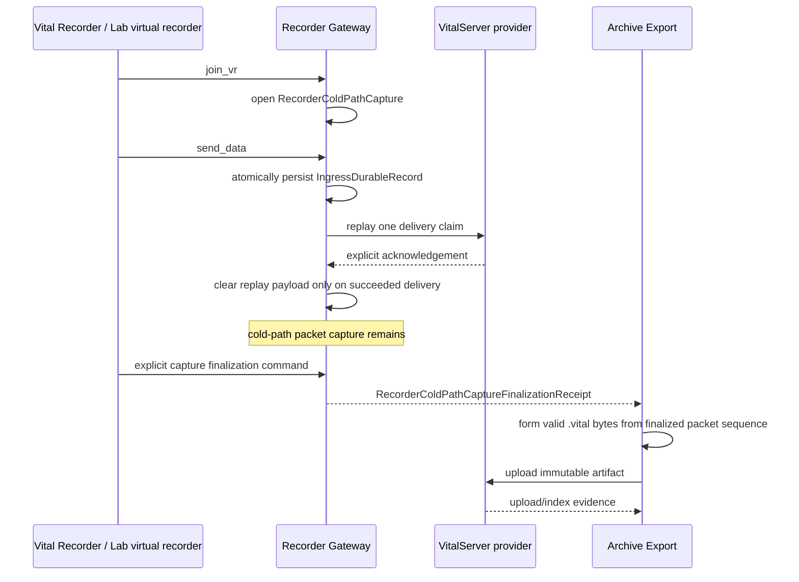

# Recorder Gateway Cold-Path Capture Boundary

> 상태: **C45 Recorder Gateway durable capture/finalization 구현됨**
>
> 범위: Recorder Gateway가 받은 `send_data` bytes의 cold-path 보존, explicit
> capture finalization, 그리고 Archive Export가 나중에 소비할 수 있는 source
> evidence 경계. Gateway 자체는 `.vital` 형성·upload·indexing 성공을 주장하지 않는다.

## 1. 문제와 결정

`send_data`의 real-time delivery replay와 종료 후 archive source 보존은 서로 다른
사실이다.

- **VitalServer delivery replay**는 선택된 VitalServer provider에게 packet을 전달하기
  위해 잠시 raw bytes를 보관한다. 성공 delivery 뒤 replay payload를 지우는 것은
  정상이다.
- **cold-path capture**는 이후 archive formation을 위해 같은 accepted packet bytes를
  보존한다. upstream delivery가 성공했더라도 이 bytes를 지우면 안 된다.

따라서 `spool`, `archive`, `upload`라는 넓은 이름 하나로 세 책임을 섞지 않는다.
Recorder Gateway는 다음 두 aggregate를 소유한다.

| Aggregate | Owner | 지속 사실 | 의미하지 않는 것 |
| --- | --- | --- | --- |
| `RecorderGatewayIngressDurableRecord` | Recorder Gateway | accepted ingress receipt, delivery replay claim, private cold-path packet capture | VitalServer delivery success 또는 `.vital` artifact 존재 |
| `RecorderColdPathCapture` | Recorder Gateway | 한 explicit recorder connection의 capture lifecycle 및 finalization receipt | Lab session lifecycle, artifact upload, upstream indexing |

`Archive Export`는 **finalized source를 실제 `.vital` bytes로 형성하고** upload/index
receipt를 소유한다. `Lab`은 scenario와 virtual-recorder execution만 소유한다.

## 2. Ubiquitous language

| 이름 | 정확한 뜻 | 사용하지 않을 모호한 이름 |
| --- | --- | --- |
| `RecorderGatewayIngressDurableStateStore` | delivery replay와 cold-path capture가 함께 들어 있는 Gateway-owned durable state | `GatewayStore`, `StateStore`, `SpoolStore` |
| `RecorderGatewayDeliveryReplay` | VitalServer `send_data` delivery를 위한 재시도 상태와 재생 payload | `Queue`, `PendingData` |
| `RecorderColdPathPacketCapture` | accepted packet의 archive-source용 private raw payload retention | `Archive`, `VitalFile` |
| `RecorderColdPathCapture` | one recorder connection에서 명시적으로 연 capture aggregate | `Session` (Lab session과 혼동) |
| `RecorderColdPathCaptureFinalizationReceipt` | capture가 immutable packet sequence source로 닫혔다는 Gateway fact | `ExportReceipt`, `ArchiveReceipt` |
| `RecorderColdPathPacketSequence` | 아직 `.vital`이 아닌, digest가 고정된 raw capture source | `VitalArtifact`, `ArchiveFile` |

이 명명은 package, file, public type, port method, control route에서 유지한다.
예를 들어 `readFinalizedRecorderColdPathPacketSequence`는 raw source를 읽는 것이고,
`uploadArtifactExportPayload`와 같은 효과를 뜻하지 않는다.

## 3. 데이터 흐름과 책임



An accepted packet is durable only when one `RecorderGatewayIngressDurableRecord` was
atomically written. That record keeps two independent retention fields:

1. `deliveryReplay` may clear its replay payload after a **succeeded** delivery receipt.
2. `coldPathPacketCapture` keeps the raw packet bytes until an explicit cold-path
   retention policy allows deletion.

No adapter infers a capture from an old log, file name, packet count, Socket.IO disconnect,
or failed upstream delivery. A capture opens at an explicit accepted `join_vr` boundary and
becomes final only through C45 `RecorderColdPathCaptureFinalizationCommand`. Existing
delivery-only durable records are migrated explicitly into a record with
`deliveryReplay` only; the migration never creates `coldPathPacketCapture` or a C45 receipt.

## 4. Finalization contract

C45 Recorder Gateway control contract is deliberately small and Guest-loopback-only.

```text
RecorderColdPathCaptureFinalizationCommand
  requestId
  coldPathCaptureId
  expectedCaptureRevision

RecorderColdPathCaptureFinalizationReceipt
  requestId
  coldPathCaptureReference
  recorderConnection
  finalizedPacketSequence
    packetCount
    payloadByteCount
    sha256
    mediaType=application/vnd.tirosh.recorder-gateway.cold-path-packet-sequence+jsonl
  finalizedAt
```

Known preconditions return C45
`RecorderColdPathCaptureFinalizationRejection`: invalid identifier, revision conflict,
unknown capture, or a capture already finalized by another request. If no valid `requestId`
was supplied, the rejection omits it rather than inventing one. A durable-write ambiguity
returns the typed C12 admission failure; it never returns an empty source or a guessed receipt.

The packet sequence is an internal raw-capture representation. Its digest is evidence for
the later Artifact Formation adapter, but it is not a `application/x-vital` claim.

## 5. Cross-context handoff

Lab does not manufacture a Gateway capture identifier. A real Lab recorder client must retain
the explicit `coldPathCaptureId` returned by its accepted `join_vr` acknowledgement and request
finalization using that exact identifier. The current Lab resource owner persists only the stable
`recorderGatewayRecorderId`; it deliberately does **not** claim that it owns an active Socket.IO
connection or a capture. Consequently, an Archive Export command must name the Gateway-issued
finalization receipt explicitly. A future Lab recorder-control adapter may automate that handoff,
but it must write the returned receipt reference as an effect result, never derive it from a
virtual-recorder name or identifier.

Archive Export consumes a finalized `RecorderColdPathPacketSequence` through a named Gateway
control port. It verifies the receipt digest before calling a separately owned
`VitalArtifactFormationPort`. Only a formatter that produces structurally validated
`application/x-vital` bytes may create `ArtifactManifest`; external VitalServer parser proof is
a separate release acceptance concern. Upload and index success remain separate Archive Export
receipts.

## 6. Current proof boundary

The old deterministic `vital-lab-source-v1` envelope has been removed. Archive Export now
requires the named C45 finalization receipt, retrieves its C45 packet sequence over the
Guest-loopback control route, verifies the published SHA-256 digest, and only then calls the
binary Vital Artifact Formation adapter. Its unit and acceptance proof establish the legacy
VITA v3 header, device/track/record packet formation, and refusal to create an empty artifact
from invalid captured data.

This is **format evidence**, not bundled or production-upstream parser
acceptance. `VitalServerIndexedLibraryHTTPArchiveExportProvider` supplies the
concrete multipart upload plus authenticated file-index verification adapter.
C37/C46/C51 now select it explicitly for an external VitalServer. C37/C46
provider mismatch blocks composition, while C51 availability is reported
explicitly after Guest Runtime starts and blocks only the later archive effect;
the
configured `archive-export-outcome-profile` remains an explicit development/test
adapter. A non-loopback external-library acceptance proves this configuration
and wire path. A release still needs bundled-image or hospital parser/index
acceptance before making those separate claims.
