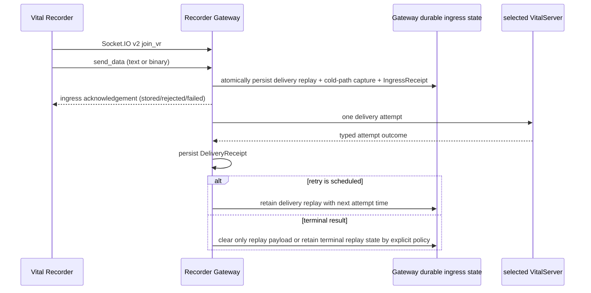

# Recorder Gateway VitalServer delivery replay와 cold-path capture data path

> 상태: **구현 및 acceptance 검증 완료**
>
> 범위: `runtime-platform/`의 Recorder Gateway, desired VitalServer delivery configuration, durable ingress state, delivery replay, cold-path capture, and delivery receipt. 이 문서는 무엇을 증명하고 무엇을 아직 주장하지 않는지 고정한다.

## 1. 목표와 비목표

목표는 첫 Recorder packet이 새 owner model을 따라 들어와서, **ingress durability**와 **upstream delivery**가 서로 다른 사실로 남는 data path를 만드는 것이다.

이 phase는 다음을 구현한다.

- Socket.IO v2 Recorder client가 handshake, `join_vr`, text/binary `send_data`, reconnect를 수행하는 protocol spike
- Gateway가 socket session과 packet admission을 소유하고 `IngressReceipt`를 영속하는 흐름
- Gateway-owned durable ingress state, bounded VitalServer delivery replay, and independent cold-path capture
- upstream attempt마다 별도 `DeliveryReceipt`를 영속하는 흐름
- selected VitalServer provider configuration이 packet delivery observation과 별도로 보존되는 흐름

다음은 이 phase의 비목표다.

- Lab, virtual recorder, raw archive, `.vital` export, delete cascade
- external upstream profile
- Recorder device health/clock observation Catalog
- Recorder command execution 또는 legacy proxy의 server-command pass-through
- NTP, telemetry export, PWA, Windows/Linux provider, installer/release proof

`req_cmd`/server dispatch wire shape는 compatibility fixture로만 유지한다. Recorder Gateway는 이 command를 실행하거나 upstream 상태를 추측하지 않고, explicit `unsupported` acknowledgement로 scope 밖임을 알린다.

## 2. owner와 데이터 흐름

| Fact | Authoritative owner | Persisted form | Must not mean |
| --- | --- | --- | --- |
| Socket connection and `join_vr` identity | Recorder Gateway | in-memory transport session | Recorder health, upstream connectivity |
| A packet reached a Gateway parser | Recorder Gateway | `IngressReceipt.packet` | durable handoff or upstream delivery |
| A packet survived the Gateway's durable admission | Recorder Gateway | `IngressReceipt.durableIngressStateHandoff=stored` + durable ingress record | VitalServer accepted it |
| One VitalServer attempt outcome | Recorder Gateway, from explicit VitalServer adapter result | `DeliveryReceipt` | all future retries or device health |
| A retained archive source packet | Recorder Gateway | private `RecorderColdPathPacketCapture` | `.vital` formation, upload, indexing, or delivery success |

The Gateway never opens or reads the Guest Runtime database. The Guest Runtime never reads Gateway durable ingress-state files. Both communicate through versioned contracts and explicit startup configuration only.

## 3. receipt and retry semantics

`C5 IngressReceipt` and `C13 DeliveryReceipt` deliberately separate two clocks and two claims.

1. `IngressReceipt.ingressState=accepted` requires `durableIngressStateHandoff.state=stored`. It says only that the Gateway made its own durable ingress-state handoff.
2. The receipt starts with `delivery.state=requested`; it is not rewritten into a delivery success.
3. Each replay attempt generates a new immutable `DeliveryReceipt` with the same `deliveryRequestId`, an increasing `attempt`, and the referenced ingress receipt.
4. `outcome=unknown` means the adapter cannot tell whether upstream received the attempt. A scheduled retry can therefore duplicate data; the receipt makes that fact visible rather than hiding it.
5. bounded retry policy returns one of `retry.not-scheduled`, `retry.scheduled`, or `retry.exhausted`. A queue depth of zero never substitutes for an unavailable upstream.
6. A repeated Recorder `send_data` event is a new ingress event unless the Recorder protocol carries an explicit stable packet identity. Payload digest equality is never used as hidden deduplication.

## 4. protocol spike decision

The Gateway runtime is provisionally TypeScript/Node. The spike uses a current Socket.IO server implementation with Engine.IO v3 compatibility enabled and a small test-only Engine.IO v3 / Socket.IO protocol-v4 wire fixture—the protocol pair used by Socket.IO v2 Recorders. The test proves the actual connection, text event, binary attachment framing, reconnect, and command-scope refusal without packaging an obsolete v2 client library. The implementation is accepted only if this test is executable in the isolated root; a source-level parser is not sufficient evidence.

The exact dependency versions, lockfile, license inventory, and the Node version bound live with `services/recorder-gateway/`. The production dependency uses a modern server line; compatibility with the device's v2 wire protocol is a tested adapter property, not a claim that the old client library is part of the product runtime.

## 5. executable acceptance

Recorder Gateway acceptance must prove at least:

1. `join_vr` establishes a Gateway-owned session, while reconnect creates a new session that must join again.
2. text `send_data` and binary attachment both receive stored ingress receipts with byte count and digest but no raw payload in receipts or logs.
3. exhausted VitalServer delivery-replay capacity or unavailable durable ingress state returns an explicit rejected/failed protocol acknowledgement **without** an ingress receipt and never says stored. Only a durable-write outcome that becomes uncertain may carry a generated correlation candidate; it is not a C5 receipt and callers must retry the same packet according to their protocol policy.
4. an unavailable selected VitalServer emits an unavailable/unknown `DeliveryReceipt`, leaves a bounded retry decision explicit, and does not turn the recorder list into `empty`.
5. a successful later attempt creates a separate succeeded `DeliveryReceipt` and clears only the corresponding delivery-replay payload; it never removes the independent cold-path capture.
6. an external delivery configuration that is missing or invalid prevents Gateway activation; it is never replaced by a bundled endpoint.

검증 명령은 `make -C runtime-platform check`이며, 여기에는 Socket.IO wire integration, bounded replay failure tests, Guest Runtime bundled capability black-box acceptance, C5/C13 schema validation이 포함된다.

The real VM, bundled VitalServer image, Host proxy route, and clean package lifecycle are not proven by this boundary. Those remain cross-platform delivery gates.
