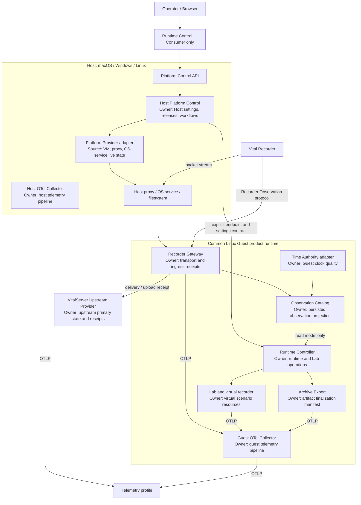

# VitalServer Runtime Platform vNext 설계 초안

> 상태: **Draft — 제안 단계**
>
> 대상: 제품/플랫폼/서비스 개발자, 운영자, QA, 보안·인프라 검토자
>
> 이 문서는 현재 배포된 Helper의 기능 명세가 아니다. 현재 구현은 [Dev Architecture](../../site-docs/dev/architecture.md)와 [Runtime v2 conformance](../runtime/runtime-v2-conformance.md)를 기준으로 하고, 이 문서는 다음 세대 플랫폼을 새 경계에서 재구축하기 위한 목표 설계다.

## 1. 왜 새 설계가 필요한가

현재 Helper는 macOS 중심의 single-node appliance로서 VitalServer, Recorder ingress, Lab, 관측과 update/recovery를 제품화했다. 이 경로는 많은 운영 사실을 검증했지만, 다음 요구를 한 구조 안에서 명확하게 표현하기에는 경계가 부족하다.

- macOS뿐 아니라 Windows와 Linux host에서 같은 제품 경험을 제공한다.
- VitalServer와 upstream Redis를 제품이 번들로 관리하는 경우와 고객 환경에 이미 존재하는 경우를 모두 지원한다.
- Vital Recorder가 제공하는 자기 관측 정보와 Gateway가 관측한 연결·전송 사실을 구분해 보존한다.
- Host, Guest, Recorder의 시계를 NTP로 지속 동기화하고 그 품질을 운영자가 확인한다.
- logs, metrics, traces를 수집하되 유료 상용 의존성이나 copyleft 재배포 부담을 기본 제품에 넣지 않는다.
- 새 인력이 전체 흐름과 각 모듈의 내부/외부 경계를 짧은 시간에 파악하고, 한 변경이 다른 모듈의 숨은 상태를 바꾸지 않게 한다.

이 문서의 결론은 “모든 것을 microservice로 쪼갠다”가 아니다. 제품 전체는 여전히 현장에 한 단위로 설치되는 **single-node service appliance**다. 다만 그 안의 책임은 versioned contract로 분리된 modular, service-oriented 구성으로 만든다.

## 2. 설계 목표와 비목표

### 2-1. 목표

| 목표 | 설계 선택 |
| --- | --- |
| host OS 차이를 product service에서 격리 | Host Platform Provider를 OS별 adapter로 둔다. 기본 product stack은 공통 Linux Guest에서 실행한다. |
| bundled/external upstream을 같은 이름으로 섞지 않음 | topology profile과 provider capability를 설치 시 명시하고, 실패 시 다른 profile로 자동 전환하지 않는다. |
| 상태의 의미를 보존 | `missing`, `invalid`, `unavailable`, `failed`, `stale`, `empty`, `unsupported`를 서로 바꾸지 않는다. |
| 장기 operation의 안전한 실행 | 상태·event·guard·effect·terminal result가 있는 durable workflow를 사용한다. |
| 의료 데이터가 섞인 현장 운영 | waveform, 원문 packet, 환자식별자, secret을 telemetry 기본 attribute에 넣지 않는다. |
| 이식성 있는 관측성 | OpenTelemetry/OTLP를 공통 emit·transport 계약으로 사용한다. |
| 새 인력의 이해 가능성 | `runtime-platform/contracts/`, `services/`, `providers/`, `product/`, `acceptance/`의 역할을 분리하고, service 간 source import를 금지한다. |

### 2-2. 비목표

- HA cluster, multi-region active-active, autoscaling platform을 vNext 1차 범위에 넣지 않는다.
- 외부 VitalServer의 내부 상태를 log, TCP 연결, Redis key, UI 화면에서 추론하지 않는다.
- external upstream이 제공하지 않은 lifecycle/update/backup 기능을 Helper가 대신 제공한다고 주장하지 않는다.
- telemetry backend의 상태를 product domain state 또는 operation 성공 근거로 쓰지 않는다.
- Linux native 실행을 Guest VM의 실패 시 자동 fallback으로 사용하지 않는다. 필요하면 독립 profile과 acceptance를 가진 별도 provider로 지원한다.

### 2-3. 참고 패턴을 적용하는 방식

vNext는 특정 외부 프로젝트의 구현이나 배포 topology를 복사하지 않는다. 대신 resource/state owner, API compatibility, stored-state migration, legacy translation, device protocol adapter, telemetry pipeline에 필요한 **제약**을 가져온다. 상세 비교와 적용·비적용 범위는 [참고 패턴과 적용 규칙](reference-patterns.md)을 기준으로 한다.

- external network/process/device/persisted-state 경계는 versioned contract와 compatibility test로 보호한다.
- 같은 deployable unit 안의 pure core와 application port는 외부 HTTP API처럼 고정하지 않고 typed contract와 focused test로 보호한다.
- 기존 Helper source, OpenAPI, fixture, `.feature`는 product behavior oracle이다. 새 product domain model이나 database schema의 runtime dependency가 아니다.
- 한 noun마다 app/process를 만들지 않는다. deployable unit은 privilege, traffic, availability boundary가 있을 때만 분리한다.

## 3. 공통 용어

| 용어 | 의미 |
| --- | --- |
| **Host** | Helper가 설치된 macOS, Windows, Linux 운영체제와 그 platform service |
| **Guest** | Host가 관리하는 공통 Linux product runtime. Linux-native profile에서는 논리적 Runtime 경계만 남을 수 있다. |
| **Platform control plane** | 설치, VM/provider lifecycle, host proxy, OS service, update, support export를 관리하는 영역 |
| **Runtime product control plane** | Guest service lifecycle, Lab, datastore maintenance, product operation을 관리하는 영역 |
| **Data plane** | Vital Recorder packet, raw archive, spool/replay, VitalServer delivery, `.vital` file upload 흐름 |
| **Time & observability plane** | 시간 품질, logs, metrics, traces, support evidence를 다루되 domain state를 소유하지 않는 교차 영역 |
| **Upstream provider** | VitalServer 및 그 primary Redis를 제공하는 주체. `bundled` 또는 `external`로 명시된다. |
| **Recorder Observation Catalog** | Recorder가 제공한 observation과 Gateway가 받은 사실을 분리해 보존하고 조회하는 Guest-owned read model |

## 4. 전체 구조



### 4-1. 구성요소 책임 지도

구성요소의 **책임**은 “무엇을 하느냐”이고, 상태 **owner**는 “어떤 사실을 authoritative하게 말하느냐”다. 둘은 관련되지만 같은 말이 아니다. 예를 들어 Platform Provider adapter는 VM을 실제로 제어하는 책임이 있지만, install workflow의 owner는 Host Platform Control이다.

각 구성요소는 하나의 주 책임을 가진다. 여러 구성요소를 걸치는 일은 한 component가 몰래 처리하지 않고, Runtime Controller나 Host Platform Control의 명시 workflow가 public port를 순서대로 호출한다.

#### Presentation과 control plane

| 구성요소 | 주 책임 | 받는 것 / 내보내는 것 | 책임 밖의 일 |
| --- | --- | --- | --- |
| **Runtime Control UI** | owner contract를 운영자가 읽고 command를 요청할 수 있게 표시 | Platform/Runtime/Catalog API read, user command request | domain transition 결정, health 추정, 다른 app database 접근 |
| **Platform Control API** | 인증·입력 검증·transport mapping, `/platform/*` public contract 제공 | UI/API request → Host Platform Control command/read | VM/OS command 실행, workflow state 저장, Guest 상태 조립 |
| **Host Platform Control** | Host setting/release/workflow를 관리하고 provider effect를 orchestration | API command + provider read → durable platform workflow/result | Guest container 내부 조사, Recorder packet 처리, upstream business state 소유 |
| **Platform Provider adapter** | Apple Virtualization/Hyper-V/KVM, OS service, host proxy의 실제 effect·live read | explicit provider command → typed OS/VM/proxy result | retry/rollback policy 결정, Host workflow 성공 선언, Guest service state 생성 |
| **Runtime Controller** | Guest service/Lab/datastore operation을 orchestration하고 control ledger를 관리 | Host endpoint/settings contract + Guest command → durable runtime operation/result | launchd/SCM/VM 제어, Host filesystem 추정, raw packet 직접 수신 |

#### Data와 product plane

| 구성요소 | 주 책임 | 받는 것 / 내보내는 것 | 책임 밖의 일 |
| --- | --- | --- | --- |
| **Host/Guest edge proxy** | Recorder·browser traffic을 정해진 backend로 전달하고 client identity contract를 보존 | network connection → bounded proxy result | Recorder 상태·bed 상태·upload 성공 판정, payload business parsing |
| **Vital Recorder** | packet과 versioned self-observation을 발생 | device data/self-report → packet, observation envelope | Gateway/Upstream의 receipt를 대신 만들기 |
| **Recorder Gateway** | transport session, payload validation, ingress receipt, durable spool/replay | packet/observation envelope → ingress receipt, delivery request, Catalog input | device health 추정, upstream primary state 소유, UI projection 생성 |
| **VitalServer Upstream Provider adapter** | bundled/external VitalServer 차이를 capability와 receipt contract로 격리 | delivery/upload/query command → provider capability/receipt | Redis schema를 다른 app에 노출, upstream 실패를 local success로 변환 |
| **Lab service** | scenario, virtual recorder resource, controlled replay의 domain resource 관리 | Lab command → virtual-recorder/session result | 실제 Recorder의 상태 변경, archive upload/indexing 성공 선언 |
| **Archive Export** | source finalization, immutable artifact manifest, upload·index verification workflow | finalized source → artifact/upload/index receipt | packet ingress ownership, upstream receipt 합성, retention policy 우회 |
| **Recorder Observation Catalog** | Recorder/Gateway/Time source observation을 분리해 영속·조회 projection으로 제공 | validated observation → page/history/query result | device 또는 Gateway의 원본 사실 수정, device command 실행 |

#### Time과 observability plane

| 구성요소 | 주 책임 | 받는 것 / 내보내는 것 | 책임 밖의 일 |
| --- | --- | --- | --- |
| **Time Authority adapter** | 해당 Host/Guest node의 NTP source/service와 clock quality를 explicit contract로 제공 | time profile command → clock quality/service status | ingestion 허용/차단 policy 결정, 다른 node clock quality 추정 |
| **TimeCompliancePolicy** | explicit clock quality와 topology policy로 guard를 순수하게 계산 | complete quality inputs → allow/warn/reject decision | NTP daemon 실행, clock read, operation state 기록 |
| **Host/Guest OTel Collector** | logs, metrics, traces를 수집·redact·route하고 pipeline health를 제공 | OTLP/structured logs → telemetry export/drop result | product health, delivery, archive, lifecycle 성공 여부 결정 |
| **Telemetry backend** | retention, query, alert evaluation | exported telemetry → query/alert result | product domain state source가 되기 |

#### 공용 contract와 product 정의

| 구성요소 | 주 책임 | 책임 밖의 일 |
| --- | --- | --- |
| **`runtime-platform/contracts/`** | API/event/receipt/capability schema와 version compatibility | I/O, state write, fallback policy |
| **`services/*/internal/<bounded-context>domain`** | 해당 owner의 pure state machine, guard, topology/time policy | filesystem, database, HTTP, shell, clock read |
| **`product/profiles`와 release manifest** | topology/time/telemetry의 deploy-time 선언과 immutable artifact identity | runtime domain decision을 script에서 재구현 |
| **`acceptance/features`와 fixture** | user-visible scenario와 real contract evidence | UI mock 또는 log text에서 domain state 추정 |

### 4-2. 상태 owner 지도

**상태 owner는 그 사실을 만들고, 허용된 transition을 적용하고, authoritative result를 제공하는 주체다.** 저장소를 가지고 있거나 화면에 값을 보여준다는 사실만으로 owner가 되지는 않는다. consumer는 owner가 공개한 versioned contract를 읽거나 command를 요청할 수 있을 뿐, owner의 상태를 추정·수정·대체하지 않는다.

같은 실제 대상에도 owner가 여러 명일 수 있다. 이때 각 owner가 말하는 **사실의 종류가 다르다**. 예를 들어 Recorder는 자기 device health와 시계 품질을 말하고, Gateway는 socket 연결과 packet 수신을 말하며, Upstream은 delivery/indexing 결과를 말한다. 하나의 사실을 다른 사실로 승격하지 않는다.

| Resource 또는 사실 | Authoritative state owner | 누가 쓸 수 있는가 | 주 소비자 | 다른 component가 하면 안 되는 일 |
| --- | --- | --- | --- | --- |
| Host install/release/settings/platform workflow | Host Platform Control | Host Platform Control | UI, Runtime Controller | Guest가 Host config/workflow를 직접 만들거나 종료하기 |
| 실제 VM, host proxy, OS service의 live lifecycle | Platform Provider와 OS resource | OS/VM provider effect, Host Platform Control이 요청 | Host Platform Control, UI | DB row나 process output으로 lifecycle을 합성하기 |
| Guest service operation, Lab session/virtual-recorder operation | Runtime Controller | Runtime Controller workflow | UI, Lab, support tooling | UI나 Host가 process 출력으로 operation terminal state 만들기 |
| 실제 Guest service readiness/liveness | 해당 Guest service와 그 explicit status adapter | 해당 service | Runtime Controller, UI | Runtime Controller가 Docker/Compose log만으로 service health를 만들기 |
| virtual recorder resource 자체 | Lab service | Lab workflow | Runtime Controller, UI | Catalog/Gateway가 virtual recorder를 start/stop했다고 표시하기 |
| socket transport session, 수신 packet, queue/replay receipt | Recorder Gateway | Gateway | Catalog, Runtime Controller, telemetry | upstream/observer가 connection 또는 packet receipt를 추측하기 |
| Recorder가 보고한 device health와 clock quality | Vital Recorder | Recorder firmware/application | Gateway, Catalog, TimeCompliancePolicy | Gateway가 packet 수신만으로 device health/time quality를 만들기 |
| observation history와 query projection | Recorder Observation Catalog | Catalog | UI, Runtime Controller | Catalog가 원본 Recorder state나 Gateway receipt를 재작성하기 |
| upstream VitalServer의 bed/recorder primary state, delivery/upload/indexing receipt | bundled 또는 external Upstream Provider | Upstream Provider | Gateway, Runtime Controller | Helper가 upstream Redis/log/HTTP success만으로 receipt를 합성하기 |
| raw archive, `.vital` manifest, upload/finalization operation | Archive Export | Archive Export workflow | Lab, Gateway, UI | file 존재/stop 완료만으로 upload/indexing success 만들기 |
| Host/Guest clock quality | 각 node의 Time Authority | 해당 node의 Time Authority adapter | TimeCompliancePolicy, UI, Catalog | 다른 node의 timestamp를 local clock quality로 추정하기 |
| telemetry pipeline health, export/drop/sampling result | 각 Collector/backend | Collector/backend | support tooling, alerts | Collector가 domain operation, Recorder, upstream 상태를 결정하기 |
| 화면의 selection, filter, draft input | Runtime Control UI | UI | UI only | UI state를 product resource 또는 operation state로 보존하기 |

`Recorder Observation Catalog`는 특히 혼동하기 쉽다. Catalog는 **기록된 observation projection의 owner**이지 Recorder device state의 owner가 아니다. 따라서 Catalog가 읽히지 않으면 “Recorder가 없다”가 아니라 “Catalog query가 unavailable/failed”다.

Host에서도 같은 구분이 필요하다. `Host Platform Control`은 install setting과 workflow를 소유하지만, 실제 VM이 running인지, nginx가 listener를 열었는지는 OS/provider가 제공한 explicit live state가 source다. Host DB row만으로 VM이 존재하거나 정상이라고 만들지 않는다.

### 4-3. owner가 공개하는 계약

| Owner | 공개하는 read contract | 받는 command | 실패를 표시하는 방식 |
| --- | --- | --- | --- |
| Host Platform Control | install, endpoint, capability, platform workflow | install/configure/start/stop/update/support export | workflow/read typed failure |
| Platform Provider / OS resource | VM, proxy, OS service lifecycle resource | Host Platform Control을 통한 start/stop/restart | live provider state와 provider failure |
| Runtime Controller | Guest service state, capability, operation history | runtime/Lab/datastore operation | durable operation terminal result |
| Recorder Gateway | ingress health, connection/packet receipt, queue state | controlled replay, gateway policy operation | ingress/delivery receipt와 retryability |
| Recorder Observation Catalog | observation page/history/query freshness | retention/rebuild operation | query read state와 source read issue |
| Upstream Provider | connection, capability, delivery/upload/index receipt | supported delivery/upload only | provider receipt 또는 `unsupported` |
| Time Authority | configuration, NTP service, clock quality | configure/start/stop NTP | quality state와 typed source failure |
| Archive Export | artifact manifest and finalization operation | finalize/upload/verify | artifact-specific terminal receipt |

### 4-4. UI와 종합 상태의 규칙

UI는 하나의 거대한 `healthy` 상태를 owner처럼 취급하지 않는다. 화면은 owner별 current read를 나란히 보여주고, 종합 상태가 필요하면 어떤 owner 결과로 계산됐는지 설명 가능한 policy projection으로만 제공한다.

| UI 영역 | 표시하는 owner contract | 종합 상태에 넣을 때의 규칙 |
| --- | --- | --- |
| Platform | Host Platform Control + Platform Provider live state | Host workflow success와 VM lifecycle을 서로 대체하지 않는다. |
| Runtime | Runtime Controller + Guest service status | Platform API가 reachable하다는 사실로 Guest service ready를 만들지 않는다. |
| Recorder | Gateway receipt + Recorder self-observation + Catalog query state | 세 가지 사실을 한 개의 `online` 값으로 뭉개지 않는다. |
| Upstream | `VitalServerUpstreamPort` connection/capability/receipt | external provider의 `unsupported`를 failure나 zero data로 바꾸지 않는다. |
| Time | 각 node의 Time Authority | timestamp가 존재한다고 synchronized라고 판단하지 않는다. |
| Observability | Collector/backend health | telemetry export가 성공해도 product operation의 success는 아니다. |

이 그림과 지도에서 중요한 점은 흐름이 하나가 아니라는 것이다.

1. UI의 명령은 control plane으로 내려간다.
2. Recorder packet은 data plane으로 지나간다.
3. Recorder self-observation은 별도의 versioned domain contract로 Catalog에 기록된다.
4. logs, metrics, traces는 진단 신호이며 위 세 흐름의 상태를 대신하지 않는다.

## 5. 배포 축: Host OS와 Upstream topology

### 5-1. Host provider

제품 API와 Guest contract는 같고, provider adapter만 OS별로 달라진다.

| Host OS | 1차 provider | Host가 소유하는 효과 |
| --- | --- | --- |
| macOS | Apple Virtualization + launchd | VM lifecycle, host proxy, signing/package, managed data path |
| Windows | Hyper-V + Windows Service | VM lifecycle, internal NAT/firewall, MSI/update, ProgramData owner |
| Linux | KVM/libvirt + systemd | VM lifecycle, network, package/release owner |

Linux native profile은 향후 가능하지만 위 세 VM provider와 다른 설치·권한·network·rollback acceptance를 가진 독립 provider다. VM bootstrap 실패를 native 실행으로 바꾸는 fallback이 아니다.

### 5-2. Upstream topology profile

설치 또는 명시적 reconfiguration 때 아래 profile 중 하나를 선택한다. profile은 `providerKind`, endpoint, credential reference, capability document, revision을 가진 owner document다.

| Profile | VitalServer / primary Redis owner | Helper가 할 수 있는 일 | 하지 않는 일 |
| --- | --- | --- | --- |
| `bundled-upstream` | Helper Guest | lifecycle, update, backup/restore, contract smoke, packet delivery, archive upload | 외부 시스템의 상태를 대신 관리하지 않음 |
| `external-upstream` | 고객/병원/별도 운영팀 | 연결 확인, 명시적으로 제공된 delivery/upload/observation capability 사용 | start/stop/update/backup을 추측하거나 bundled stack을 자동 기동하지 않음 |

`external-upstream`에서 연결이 실패하면 결과는 `unavailable` 또는 `failed`다. 이때 같은 요청을 bundled upstream으로 재시도하거나 UI에 빈 recorder 목록을 보여주지 않는다.

`external-relay-target`은 upstream topology가 아니다. 이는 bundled/external upstream과 독립적으로 공존할 수 있는 `OutboundRelayTarget` integration resource이며, relay consumer의 decode·pending·business 처리 성공을 Helper가 추정하지 않는다. relay target의 상태는 upstream connection/capability 상태를 바꾸지 않는다.

### 5-3. Upstream Anti-Corruption Layer

Guest application은 upstream 구현/Redis schema에 직접 의존하지 않고 다음 port만 사용한다.

```text
VitalServerUpstreamPort
  checkConnection() -> UpstreamConnectionState
  readCapabilities() -> UpstreamCapabilities
  deliverRecorderData(command) -> DeliveryReceipt
  uploadVitalFile(command) -> UploadReceipt
  verifyVitalFileIndexed(query) -> IndexingReceipt
  readObservation(query) -> ObservationResult | unsupported
```

각 receipt에는 `operationId`, upstream provider identity, 요청 식별자, 발생 시각, 성공/실패 상태, typed reason, retryability, evidence reference가 들어간다. HTTP 200, socket connect, container liveness만으로 delivery나 indexing 성공을 만들지 않는다.

### 5-4. `RuntimeTopology` resource

topology profile은 설정 blob이나 UI selection이 아니라 Runtime Controller가 소유하는 versioned `RuntimeTopology` resource다. Kubernetes의 resource/observed-status 분리와 Terraform의 persisted-state upgrade 원칙을 적용하되, Kubernetes controller나 Terraform plan을 도입하지는 않는다.

```text
RuntimeTopology
  id
  schemaVersion
  resourceRevision
  spec:
    profileKind: bundled-upstream | external-upstream
    providerKind
    endpointReference
    credentialReference
  status:
    readState
    connectionState
    capabilityDocumentReference
    capabilityRevision
    observedAt
    lastOperationReference
```

- `spec`은 requested configuration이고 secret 원문을 포함하지 않는다.
- `status`는 Runtime Controller가 `VitalServerUpstreamPort`의 explicit result로만 기록한다. endpoint가 reachability를 보였다는 사실은 delivery/upload/index success가 아니다.
- topology 재구성은 `Operation`으로 실행한다. operation은 requested resource revision, preflight result, drain/cutover/rollback step, terminal proof를 보존한다.
- external upstream의 capability가 없으면 `unsupported`를 반환한다. product release나 HTTP header만으로 capability를 추정하지 않는다.

## 6. 코드와 의존성 경계

새 구현은 기존 source를 runtime dependency로 가져오지 않는 repository 최상위 `runtime-platform/` root에서 시작한다. 기존 저장소는 protocol 사실, fixture, acceptance oracle로만 참조한다. 실제 directory layout, implementation language, phase별 acceptance는 [vNext 구현 계획](vnext-implementation-plan.md)을 기준으로 한다.

```text
runtime-platform/
  contracts/                    # language-neutral, versioned API/event/state source
  services/
    host-agent/                 # Go: Host control, OS adapters, Host SQLite
    guest-runtime/              # Go: topology/operation/Lab/archive/Catalog modules
    recorder-gateway/           # TypeScript: Socket.IO ingress, spool/replay
    runtime-pwa/                # TypeScript: generated client and presentation
  providers/
    macos-virtualization/       # Swift: Host Agent가 호출하는 effect bridge
  product/
    profiles/                   # topology, time, telemetry declarations
    guest/                      # image, Compose, storage, systemd declaration
    packaging/                  # OS artifact input; application policy 없음
  acceptance/
    features/                   # user-visible BDD specification
    reference-fixtures/         # frozen legacy behavior oracle with provenance
    harness/                    # real Host/Guest/upstream/device runners
  tooling/                      # contract bundle generation/compatibility verification; runtime dependency 없음
```

### 6-1. `apps`와 `packages`를 나누는 기준

| 위치 | 넣어야 하는 것 | 넣지 말아야 하는 것 |
| --- | --- | --- |
| `services/*` | process, API, workflow composition, service-local pure domain policy, database adapter, OS/HTTP/network effect | sibling source import, 다른 service database, shared helper dump |
| `contracts/` | versioned DTO, enums, capability and receipt schema, generated transport type source | filesystem/network/database read, business fallback |
| `services/*/internal/<bounded-context>domain` | 해당 owner의 pure policy, state machine, validation, deterministic mapping | shell, HTTP, database, cache, clock read |
| `providers/*` | OS-specific typed effect adapter | Host workflow owner, public API, Guest domain state |
| `product/` | image, Compose, proxy, profile, release topology | application policy를 shell script에 복제한 코드 |
| `acceptance/` | `.feature`, real adapter fixture, evidence rules | UI-only mock state 또는 log-text parsing을 state 판단으로 쓰는 step |

service 간 통신은 public contract와 API/queue boundary를 통한다. 단지 같은 monorepo에 있다는 이유로 다른 service의 internal type, ORM model, database table을 import하거나 읽지 않는다.

## 7. 상태 owner의 저장소와 계약 상세

### 7-1. 저장소는 역할로 나눈다

| 데이터 | Authoritative owner | 저장소 | 소비 방식 |
| --- | --- | --- |
| Host install/release/settings/workflow | Host Platform Control | Host-local SQLite + OS-owned files | Platform API가 explicit read result를 제공 |
| VM/proxy/OS service live lifecycle | OS resource through Platform Provider | OS/VM provider API; Host DB는 workflow/config only | Platform Control이 explicit live read를 제공 |
| Guest service/Lab operation | Runtime Controller | Guest control ledger | operation API와 durable event history |
| Recorder observation catalog | Recorder Observation service | Guest PostgreSQL | versioned query API |
| upstream VitalServer primary state | bundled 또는 external upstream | upstream가 소유한 store/Redis | `VitalServerUpstreamPort` receipt/capability만 소비 |
| ingress durable spool | Recorder Gateway | product-owned Redis | retry/replay adapter 내부에서만 사용 |
| raw packet/archive 및 `.vital` artifact | Archive owner | policy가 정한 durable file/object storage | immutable artifact manifest와 receipt |
| telemetry | Collector/backend | log file, Prometheus, Jaeger, optional OpenSearch | diagnosis/alert/support만 사용 |

Redis는 세 역할을 섞지 않는다.

1. **upstream primary Redis**: VitalServer가 소유한다. bundled 또는 external일 수 있다.
2. **Gateway durability Redis**: ingress queue, controlled replay, dead-letter를 product가 소유한다.
3. **Redis relay target**: 외부 consumer가 소유한다.

어느 Redis의 값도 다른 Redis의 state를 대신하거나, 실시간 packet 성공과 archive upload 성공을 대신하지 않는다.

### 7-2. 공통 상태 표현

모든 read contract는 값뿐 아니라 읽기 결과를 표현한다.

| 상태 | 뜻 |
| --- | --- |
| `available` | owner가 유효한 현재 값을 제공했다. |
| `missing` | owner document/resource가 존재하지 않는다. |
| `invalid` | 존재하지만 schema 또는 invariant를 만족하지 않는다. |
| `unavailable` | owner 또는 dependency에 접속할 수 없다. |
| `failed` | 명시 operation 또는 owner read가 실패했다. |
| `stale` | owner가 제공한 값이 freshness 정책을 넘겼다. |
| `empty` | 유효한 조회 결과가 0건이다. |
| `unsupported` | 현재 provider capability가 그 기능을 제공하지 않는다. |

`empty`는 `unavailable`의 표시값이 아니며, `unsupported`는 `disabled`나 `failed`의 별칭이 아니다.

### 7-3. operation lifecycle

긴 작업은 사용자 요청, 실행, terminal result를 같은 document에 보존한다.

```text
requested -> accepted -> running -> succeeded
                               -> failed
                               -> cancelled
                               -> interrupted
```

- transition guard와 command/effect selection은 pure domain policy가 결정한다.
- 실제 VM start, NTP service configure, packet replay, `.vital` upload 같은 side effect는 application port/adapters가 실행한다.
- terminal result에는 `operationId`, resource revision, start/finish time, typed failure, evidence reference가 남는다.
- UI는 버튼 enablement를 API capability와 current owner state로만 정한다. UI가 “running처럼 보인다”는 이유로 operation state를 새로 만들지 않는다.

### 7-4. API 경계와 version 범위

모든 code call을 public API로 취급하지 않는다. version을 강하게 관리할 경계와 typed code contract로 충분한 경계를 구분한다.

| 경계 | 예시 | 안정성 규칙 | version 식별자 |
| --- | --- | --- | --- |
| Operator/Browser → Platform Control | 설치, topology, status, operation 조회/요청 | 외부 consumer가 쓰는 public API. 같은 major에서 source/wire/semantic 의미를 유지한다. | `apiVersion` |
| Host ↔ Guest | Host endpoint/settings, Guest runtime command/read | 별도 process/OS 경계. Host와 Guest가 서로 내부 state를 읽지 않는다. | `apiVersion` |
| Recorder ↔ Gateway | Socket.IO packet, self-observation | device wire contract. protocol decoder와 replay fixture가 compatibility를 검증한다. | `protocolVersion` |
| Guest → upstream provider | delivery, upload, observation query | upstream shape를 adapter에서 receipt/capability로 번역한다. | contract package version, capability revision |
| owner-owned persisted document | topology, operation, Catalog, Gateway metadata | schema와 migration은 owner가 제공한다. | `schemaVersion`, `resourceRevision` |
| same-process internal port | pure core ↔ workflow adapter | source import가 아닌 typed interface와 focused test로 보호한다. | independent API version 없음 |

동일 API major에서 optional field를 추가할 수는 있지만, 기존 field의 삭제·rename·type 변경, enum 의미 변경, optional field의 필수화, failure를 empty/success로 바꾸는 것은 breaking change다. 새 major 또는 새 resource로 추가한다.

Browser가 쓰는 public control endpoint는 하나의 facade다. `/platform/*` resource는 Host Platform Control이 직접 소유하고, `/runtime/*` resource는 인증·authorization 뒤 Guest Runtime의 versioned contract로 전달한다. Host facade는 Guest response를 조립·정상화하거나 Host DB state로 대체하지 않는다. 이 규칙은 UI가 Host/Guest database를 직접 읽거나 두 owner의 사실을 하나의 성공으로 합치는 것을 막는다.

명령 입력이 invalid하거나 owner가 effect 전에 명시적으로 non-admission을 결정하면 `CommandRejection`을 반환하며 `Operation`은 없다. owner state store failure처럼 admission 존재 여부 자체를 알 수 없으면 `CommandAdmissionFailure(admissionState=unknown)`을 반환하고, caller는 같은 request ID로 recovery 후 재시도한다. 실행을 위해 durable operation이 먼저 저장된 뒤에는 observed execution failure가 terminal `Operation.state=failed`로 남는다. external effect 뒤 terminal outcome persistence가 실패하면 `running` operation을 유지하며 성공/실패를 추정하지 않는다. concrete flow와 executable proof는 [Host/Guest Control Slice](host-guest-control-boundary.md)에 기록한다.

### 7-5. stored-state migration과 compatibility window

product release version, external API major, device protocol version, provider capability revision, stored document schema version은 별개다. release가 올라갔다고 consumer가 자동으로 새 capability를 가진다고 가정하지 않는다.

각 persistent owner는 다음을 제공한다.

1. 현재 `schemaVersion`과 지원하는 이전 version 목록
2. 이전 document를 현재 document로 변환하는 explicit upgrader
3. migration 전·후 validation, atomic write, original/current version과 result가 포함된 evidence
4. old-schema, malformed document, permission failure, interrupted migration fixture

migration은 owner repository를 통해서만 실행한다. decode 또는 migration이 실패한 문서를 empty/default success로 전환하지 않고 `invalid` 또는 `failed`로 보고한다. migration bridge와 legacy API compatibility는 명시된 deprecation/cutover window 안에서만 유지하며, 제거 release와 acceptance proof 없이는 영구 branch로 남기지 않는다.

## 8. Recorder, Lab, archive lifecycle

### 8-1. Recorder lifecycle

Recorder의 connection, packet, self-report, upstream delivery는 서로 다른 owner가 말한다.

| 사실 | owner | 예시 |
| --- | --- | --- |
| Recorder가 자기 상태와 시계를 보고함 | Vital Recorder | boot ID, sequence, device health, clock quality |
| socket 접속과 packet 수신 | Recorder Gateway | transport session, receivedAt, byte count, parse result |
| packet delivery와 retry | Gateway + Upstream provider | delivery receipt, retryable failure, dead letter |
| bed/recorder business projection | upstream 또는 Observation Catalog | explicit API/read model 결과 |
| Virtual Recorder 실행 | Lab | scenario session의 recorder operation |

VRecorder self-observation은 별도 versioned envelope를 사용한다.

```text
RecorderObservationEnvelope
  schemaVersion
  recorderId
  bootId
  sequence
  occurredAt
  time: { state, sourceId, offsetMs, uncertaintyMs, lastSyncAt }
  runtime: { state, version, healthSummary }
```

Gateway는 원문 `occurredAt`을 덮어쓰지 않고 `receivedAt`을 추가한다. Catalog는 `persistedAt`과 ingestion outcome을 추가한다. `bootId + sequence` 또는 명시 idempotency key로 reconnect·재전송·재부팅을 구분한다.

### 8-2. Lab 종료와 `.vital` artifact

Lab recorder는 단순히 `running` 표시를 없애는 것으로 끝나지 않는다. 종료는 Archive Export workflow를 시작한다.

```text
stop requested
  -> recorder stop acknowledgement
  -> source finalization
  -> archive manifest creation
  -> upload to upstream
  -> upstream indexing verification
  -> succeeded | failed
```

Ingress cold path도 같은 finalization contract를 사용한다. “수신이 멈췄다”, “파일이 보인다”, “upload request를 보냈다”는 각각 다른 사실이다. 업로드와 indexing verification receipt가 있어야 artifact workflow가 성공한다.

### 8-3. hide와 delete

`hide`는 UI visibility만 바꾸는 명령이다. `delete`는 resource lifecycle 명령이며, 다음이 모두 명시적으로 완료되어야 한다.

- resource가 active session에 연결되어 있으면 stop/finalize 또는 typed refusal을 먼저 기록한다.
- recorder/bed/session/assignment/read model row의 삭제 대상과 보존 대상이 policy에 따라 명확해야 한다.
- archive 삭제 여부는 lifecycle 삭제와 별도의 retention policy로 표현한다.
- 성공 response는 실제 owner delete receipt를 기반으로 한다. view에서 사라졌다는 사실만으로 delete 성공을 만들지 않는다.

## 9. 시간 동기화

boot 시 Host가 Guest에 제공하는 시간은 pre-network bootstrap input이다. 이는 지속 NTP 동기화의 대체물이 아니다.

### 9-1. Time Authority contract

```text
TimeAuthorityPort
  configureSource(profile, source) -> ConfigurationReceipt
  startNtpService() -> OperationReceipt
  stopNtpService() -> OperationReceipt
  readClockQuality() -> ClockQuality
  readNtpServiceStatus() -> ServiceStatus
```

`ClockQuality`는 최소한 `configured`, `synchronizing`, `synchronized`, `unsynchronized`, `stale`, `unsupported`, `failed`와 source identity, stratum, offset, uncertainty, last sync time, observed time, failure reason을 포함한다.

### 9-2. 지원 profile

| Profile | 의미 |
| --- | --- |
| `enterprise-ntp` | Host, Guest, Recorder가 병원/고객이 승인한 NTP source를 사용한다. |
| `helper-ntp` | Host가 승인된 source와 동기화한 뒤 Guest와 Recorder에 NTP를 제공한다. UDP 123, firewall, source health는 Host owner가 명시적으로 관리한다. |

임의로 Host와 Guest가 서로 다른 source를 쓰거나, NTP 실패 시 boot timestamp를 current synchronized state로 표기하지 않는다. 시간 품질이 data ingestion을 막는지 경고만 하는지는 `TimeCompliancePolicy`라는 명시 policy가 정한다.

## 10. Observability: logs, metrics, traces

### 10-1. 채택 원칙

관측성의 표준 transport는 **OpenTelemetry/OTLP**로 고정한다. OpenTelemetry Collector는 logs, metrics, traces를 받아 processor/exporter로 전달하는 vendor-neutral collector이며 Apache-2.0으로 배포된다. [OpenTelemetry Collector](https://github.com/open-telemetry/opentelemetry-collector)

기본 제품 license 정책은 **Apache-2.0, MIT, BSD 등 permissive license만 허용**이다. “무료”라는 이유만으로 copyleft component를 기본 bundle에 넣지 않는다. 실제 release는 image와 transitive dependency를 포함한 SBOM/license gate를 통과해야 하며, 이 문서는 법률 자문을 대신하지 않는다.

### 10-2. 권장 stack

| Signal | 표준 구성 | 역할 |
| --- | --- | --- |
| Logs | JSON structured log + OTel Collector file/OTLP receiver | 발생한 사실, 원인, evidence reference 보존 |
| Metrics | Prometheus | capacity, backlog, latency, error ratio, freshness, resource health |
| Traces | Jaeger + OTLP | 한 operation이 여러 process를 지나는 경로와 지연 파악 |
| 검색형 log store | optional OpenSearch | 장기/대량 log query가 필요한 profile에서만 사용 |

[Prometheus](https://github.com/prometheus/prometheus), [Jaeger](https://github.com/jaegertracing/jaeger), [OpenSearch](https://github.com/opensearch-project/OpenSearch)는 Apache-2.0 기반 프로젝트다. Grafana Loki는 비용 없이 쓸 수는 있지만 AGPL이므로 기본 제품 profile에서는 제외한다. [Loki license](https://github.com/grafana/loki/blob/main/LICENSE)

하나의 관측 UI를 최우선으로 요구하는 환경에서는 Apache-2.0인 [Apache SkyWalking](https://github.com/apache/skywalking)을 별도 PoC 후보로 검토할 수 있다. 하지만 Java OAP와 storage 운영이 추가되므로, appliance 기본값으로 바로 채택하지 않는다.

### 10-3. telemetry profile

| Profile | 구성 | 적합한 환경 |
| --- | --- | --- |
| `local-support` | Host/Guest Collector, Prometheus, Jaeger, bounded JSON logs/support export | 단일 현장 장비, 지원 자료 중심 운영 |
| `central-observability` | Collector가 고객이 제공한 OTLP/metrics/log endpoints로 export | 병원 중앙 관제 또는 여러 Helper 운영 |
| `bundled-full-observability` | `local-support` + OpenSearch | 장기 로그 검색이 현장 appliance 자체에 필요한 경우 |

모든 profile은 L/M/T를 emit한다. 다만 local profile은 OpenSearch 같은 무거운 검색 DB를 기본으로 강제하지 않고, bounded raw log와 support bundle을 제공한다. backend endpoint 또는 credential이 없으면 central profile은 `unavailable`로 나타나며 local profile로 몰래 전환하지 않는다.

### 10-4. signal 경계

| Signal | 반드시 담을 것 | 넣지 말아야 할 것 |
| --- | --- | --- |
| Log | operation ID, component, event name, typed failure, evidence reference | waveform, raw packet, patient name/identifier, credential/token |
| Metric | queue depth, retry count, delivery latency, archive duration, NTP freshness, CPU/memory | recorder ID·bed ID·session ID 같은 high-cardinality label, raw payload |
| Trace | operation/span ID, component, topology profile, sanitized upstream result | PHI, payload, secret, unstable object dump |

대표 correlation attribute는 `service.name`, `service.version`, `deployment.profile`, `operation.id`, `session.id`, `upstream.provider.id`다. recorder ID와 bed ID는 metrics label 대신 authorized log/Catalog query에서만 사용한다.

OTel trace가 sampling으로 누락되어도 domain operation receipt는 남아 있어야 한다. 반대로 span이 존재한다고 archive upload나 lifecycle operation이 성공한 것은 아니다.

### 10-5. Host와 Guest collector 경계

- Host Collector는 platform process, OS service, Host workflow telemetry를 수집한다.
- Guest Collector는 Runtime Controller, Gateway, Lab, Archive Export, Catalog 및 Guest service telemetry를 수집한다.
- Host는 Guest container log를 무단으로 해석해 runtime state를 만들지 않고, Guest가 제공하는 API/OTLP contract만 소비한다.
- Guest는 Host filesystem/launchd/SCM 상태를 추정하지 않고 Platform API가 제공한 contract만 소비한다.
- remote collector/backend 전송은 TLS/mTLS와 명시적 credential owner를 사용한다.

## 11. 주요 사용 흐름

### 11-1. Bundled upstream으로 Recorder packet을 수집하는 경우

1. Platform Provider가 Guest endpoint와 proxy state를 explicit contract로 제공한다.
2. Recorder Gateway가 Recorder connection과 packet을 수신하고 ingress receipt를 기록한다.
3. Gateway가 raw archive/spool policy를 적용한 뒤 bundled `VitalServerUpstreamPort`에 delivery를 요청한다.
4. upstream delivery receipt와 Catalog observation은 각 owner가 기록한다.
5. Collector는 이 과정의 L/M/T를 수집하지만 결과를 판정하지 않는다.

### 11-2. External VitalServer를 사용하는 경우

1. topology owner가 `external-upstream` endpoint, credential reference, capability revision을 제공한다.
2. Gateway/Runtime Controller가 `checkConnection`과 `readCapabilities`를 수행한다.
3. provider가 `uploadVitalFile` 또는 `readObservation`을 제공하지 않으면 UI는 `unsupported`를 표시한다.
4. connection 실패는 `unavailable`/`failed`로 보존한다. bundled stack을 기동하거나 Redis를 직접 읽어 보완하지 않는다.

### 11-3. Recorder의 시계가 불량한 경우

1. Recorder self-observation 또는 Time Authority가 explicit clock quality를 제공한다.
2. Catalog와 telemetry에 quality·offset·observedAt을 기록한다.
3. `TimeCompliancePolicy`가 profile별 guard를 계산한다.
4. policy가 reject라면 Gateway는 typed refusal receipt를 반환한다. warn policy라면 수집은 계속하되 alertable event가 남는다.

### 11-4. Lab session을 종료하는 경우

1. Runtime Controller가 stop operation을 durable operation으로 생성한다.
2. 각 virtual recorder의 stop/finalization 결과를 기다린다.
3. Archive Export가 manifest, upload receipt, indexing receipt를 기록한다.
4. 모두 성공해야 session terminal state가 `succeeded`가 된다. 일부 실패는 session과 artifact의 explicit failed state로 남는다.

## 12. 보안, 개인정보, 지원 자료

- endpoint, token, certificate, data path는 각각 owner document에서 관리하며 UI/telemetry에 secret 값을 노출하지 않는다.
- support export는 allowlist 기반이다. Product settings, API token, raw packet payload, datastore dump는 기본 export 대상이 아니다.
- recorder/bed/session은 업무상 식별자가 될 수 있으므로 telemetry에서 최소화하고, 필요한 세부 조사는 권한 있는 Catalog/API query로 제한한다.
- central observability는 customer network boundary와 retention policy를 명시해야 한다. 결과 endpoint가 없어도 local telemetry evidence를 성공처럼 표기하지 않는다.
- 모든 release artifact는 SBOM, third-party notices, license allowlist 결과를 함께 생성한다.

## 13. 검증 전략

설계 문서가 구현의 대체물이 되지 않도록, 각 boundary는 아래 evidence를 가져야 한다.

| 범위 | 검증 |
| --- | --- |
| Contracts | schema/compatibility/negative decode test. missing·invalid·unsupported를 success로 바꾸지 않는지 확인 |
| Core policy | state transition, topology capability, time compliance, deletion/finalization guard unit test |
| Adapters | Host provider, upstream provider, OTLP exporter, NTP service, archive storage integration test |
| Cross-app | real versioned API/queue contract test. 다른 app database를 직접 읽는 test는 금지 |
| API evolution | same-major additive change, breaking change rejection, capability `unsupported`, command vs operation failure를 contract test |
| State migration | old-schema, malformed schema, permission/interruption fixture와 owner-owned upgrader test |
| Platform | macOS/Windows/Linux install, reboot, upgrade/rollback, proxy, Guest endpoint acceptance |
| Topology | bundled/external upstream 각각에 대한 capability and failure acceptance |
| Data lifecycle | Lab stop → artifact finalize → upload → index verify; delete → no orphan session/read model acceptance |
| Observability | redaction, cardinality, trace propagation, backend unavailable, support export acceptance |
| BDD | 사용자 시나리오와 `.feature` ID가 1:1이며 real adapter evidence로 연결 |

VM boot failure, Guest bootstrap failure, image proof failure, package install failure는 “경고가 있는 성공”이 아니라 release compile/acceptance failure로 보고한다.

## 14. 구현 순서

이 설계는 한 번에 대체하지 않는다. 각 단계는 독립적으로 deploy·rollback·acceptance 가능한 경계여야 한다.

1. **Contracts와 terminology**: topology, capability, receipt, operation, time quality, recorder observation envelope를 먼저 versioned package로 정의한다.
2. **Runtime skeleton**: common Guest Runtime Controller, Host Provider contract, Platform API/PWA read model을 만든다.
3. **Bundled data path**: Recorder Gateway, spool/archive, `VitalServerUpstreamPort`, artifact finalization을 구현한다.
4. **Catalog와 deletion semantics**: Recorder Observation Catalog, session/resource lifecycle, hide/delete policy를 구현한다.
5. **Time authority**: enterprise/helper NTP profile, clock quality API, policy/acceptance을 추가한다.
6. **L/M/T**: OTel conventions/collector, Prometheus/Jaeger, support export와 redaction gate를 추가한다.
7. **External upstream**: ACL adapter, capability negotiation, external VitalServer/Redis acceptance fixture를 추가한다.
8. **Platform expansion**: macOS, Windows, Linux provider를 같은 contract matrix로 검증한다.

각 단계는 기존 시스템에서 배운 protocol fixture와 BDD scenario를 재사용할 수 있지만, 기존 app source를 새 runtime에 import하지 않는다.

### 14-1. 기존 제품에서의 점진 전환 규칙

기존 Helper는 기능을 보존할 **행동 oracle**이며 vNext의 shared database 또는 runtime library가 아니다. 전환은 Strangler Fig/Anti-Corruption Layer 원칙을 capability 단위로 적용한다.

1. 먼저 기존 protocol, error, receipt, user-visible result를 fixture와 acceptance scenario로 고정한다.
2. 새 adapter와 새 owner를 같은 fixture에서 검증하고, 필요하면 bounded non-production replay로 결과를 비교한다.
3. 명시한 capability 하나만 cutover한다. waveform·patient data를 두 authoritative store에 무기한 dual-write하지 않는다.
4. cutover 뒤에는 새 owner 하나만 write하며, legacy bridge의 제거 release와 rollback 조건을 operation evidence에 남긴다.

ACL/facade는 upstream 또는 legacy semantics를 번역하는 경계일 뿐 domain policy, hidden retry fallback, shared state owner가 아니다.

## 15. 결정과 열린 질문

### 15-1. 이 문서에서 결정한 것

- 제품은 pure microservices platform이 아니라 single-node appliance로 패키징된 distributed modular system이다.
- `bundled`와 `external` upstream은 명시 topology이며 fallback 관계가 아니다.
- common Linux Guest를 기본 실행 경계로 유지하고 host 차이는 provider adapter에 둔다.
- Host SQLite, Guest control ledger, Catalog PostgreSQL, Gateway Redis, upstream Redis의 소유권을 혼합하지 않는다.
- Recorder self-observation은 domain contract이고, OpenTelemetry는 internal diagnostics contract다.
- boot time handoff와 continuous NTP는 다른 책임이다.
- OpenTelemetry + Prometheus + Jaeger를 기본 L/M/T 방향으로 하고, OpenSearch는 선택 profile이다.

### 15-2. PoC 또는 제품 결정이 더 필요한 것

| 질문 | 결정을 위해 필요한 증거 |
| --- | --- |
| Jaeger의 장기 trace storage를 어떤 permissive backend로 운영할 것인가 | retention, disk, restore, query load, license 포함 PoC |
| local-support profile의 기본 retention과 resource reservation은 무엇인가 | 현장 hardware와 failure injection 측정 |
| `helper-ntp`가 필요한 모든 현장 네트워크에서 UDP 123을 허용하는가 | 병원 network/security 승인 및 device interoperability test |
| external VitalServer가 제공할 수 있는 capability 범위는 무엇인가 | vendor/customer별 contract fixture와 certified adapter matrix |
| archive 보존과 삭제의 법적/운영 기간은 무엇인가 | data governance와 clinical workflow owner의 정책 |

## 16. 관련 문서

- [현재 제품 아키텍처](../../site-docs/dev/architecture.md)
- [현재 Runtime contract와 상태 규칙](../../site-docs/dev/runtime-contracts.md)
- [현재 cross-platform conformance](../runtime/runtime-v2-conformance.md)
- [vNext 참고 패턴과 적용 규칙](reference-patterns.md)
- [vNext 구현 계획](vnext-implementation-plan.md)
- [제품 사용 시나리오 카탈로그](../product/user-scenarios.md)
- [Vital Recorder integration contract](../recorder/vital-recorder-integration.md)
- [Ingress flow-control contract](../recorder/send-data-flow-control.md)
- [기존 troubleshooting index](../troubleshooting/index.md)
